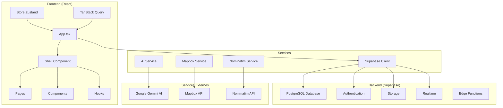
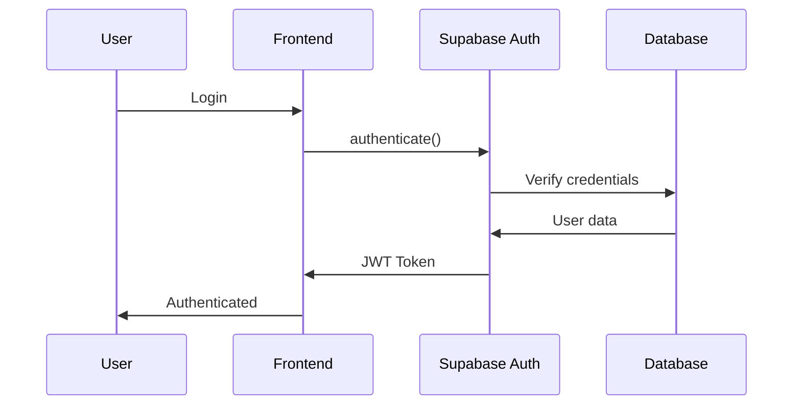
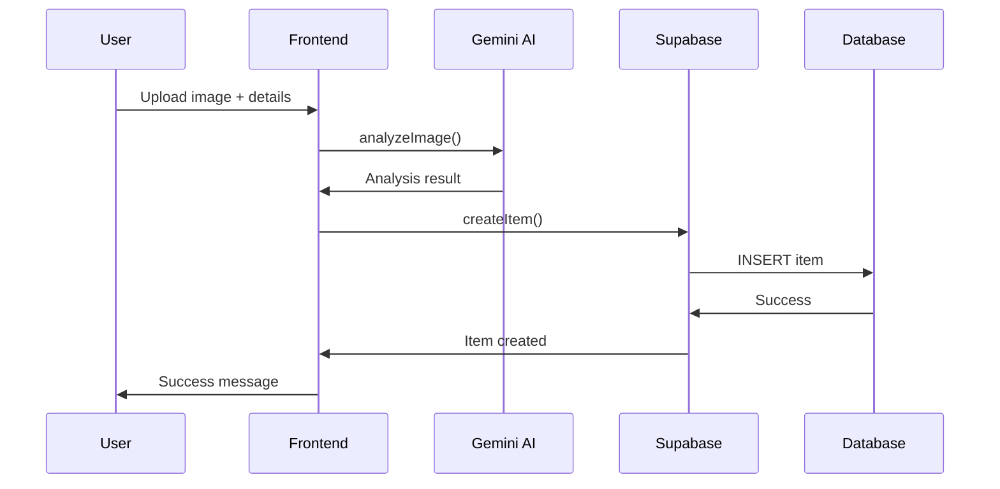
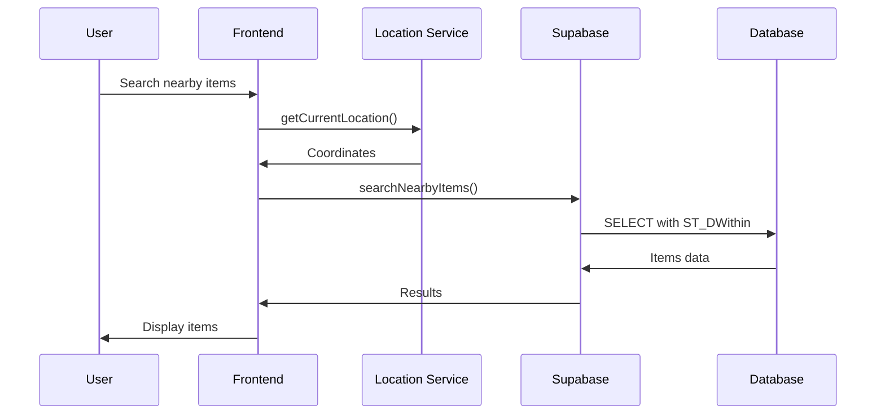

# Architecture Échangeo 🏗️

## Vue d'ensemble

Échangeo est une application web moderne construite avec une architecture **JAMstack** (JavaScript, APIs, Markup) utilisant React comme frontend et Supabase comme backend-as-a-service.

## Diagramme d'Architecture



## Architecture Frontend

### Structure des Composants

```
src/
├── App.tsx                 # Point d'entrée principal
├── components/
│   ├── Shell.tsx          # Layout principal avec navigation
│   ├── admin/             # Composants d'administration
│   ├── ui/                # Composants UI réutilisables
│   └── modals/            # Modales et overlays
├── pages/                 # Pages de l'application
├── hooks/                 # Hooks React personnalisés
├── services/              # Services externes
├── store/                 # État global (Zustand)
├── types/                 # Types TypeScript
└── utils/                 # Utilitaires
```

### Gestion d'État

L'application utilise une approche hybride pour la gestion d'état :

- **Zustand** : État global client (authentification, préférences utilisateur)
- **TanStack Query** : Cache et synchronisation des données serveur
- **React Hook Form** : État local des formulaires
- **useState/useReducer** : État local des composants

### Patterns Architecturaux

#### 1. Container/Presenter Pattern
```typescript
// Container (logique métier)
const ItemsContainer = () => {
  const { data: items, isLoading } = useItems();
  const { mutate: createItem } = useCreateItem();
  
  return <ItemsPresenter 
    items={items} 
    isLoading={isLoading}
    onCreateItem={createItem}
  />;
};

// Presenter (présentation)
const ItemsPresenter = ({ items, isLoading, onCreateItem }) => {
  return (
    <div>
      {isLoading ? <Loading /> : <ItemsList items={items} />}
    </div>
  );
};
```

#### 2. Custom Hooks Pattern
```typescript
// Hook métier réutilisable
const useItems = () => {
  return useQuery({
    queryKey: ['items'],
    queryFn: () => supabase.from('items').select('*'),
  });
};
```

#### 3. Service Layer Pattern
```typescript
// Service abstrait
class ItemService {
  static async create(item: CreateItemData) {
    return supabase.from('items').insert(item);
  }
  
  static async getById(id: string) {
    return supabase.from('items').select('*').eq('id', id).single();
  }
}
```

## Architecture Backend

### Supabase comme Backend-as-a-Service

Supabase fournit :
- **PostgreSQL** : Base de données relationnelle
- **Authentication** : Gestion des utilisateurs et sessions
- **Storage** : Stockage de fichiers (images)
- **Realtime** : Synchronisation temps réel
- **Edge Functions** : Serverless functions (futur)

### Base de Données

#### Tables Principales

```sql
-- Profils utilisateurs
profiles (
  id uuid PRIMARY KEY,
  email text UNIQUE,
  full_name text,
  avatar_url text,
  bio text,
  phone text,
  address text,
  latitude double precision,
  longitude double precision,
  created_at timestamptz,
  updated_at timestamptz
)

-- Objets à échanger
items (
  id uuid PRIMARY KEY,
  owner_id uuid REFERENCES profiles(id),
  title text NOT NULL,
  description text,
  category text CHECK (category IN ('tools', 'electronics', ...)),
  condition text CHECK (condition IN ('excellent', 'good', 'fair', 'poor')),
  offer_type text CHECK (offer_type IN ('loan', 'trade', 'donation')),
  brand text,
  model text,
  estimated_value numeric,
  tags text[],
  available_from timestamptz,
  available_to timestamptz,
  location_hint text,
  latitude double precision,
  longitude double precision,
  community_id uuid REFERENCES communities(id),
  is_available boolean DEFAULT true,
  created_at timestamptz,
  updated_at timestamptz
)

-- Demandes d'échange
requests (
  id uuid PRIMARY KEY,
  requester_id uuid REFERENCES profiles(id),
  item_id uuid REFERENCES items(id),
  message text,
  status text CHECK (status IN ('pending', 'approved', 'rejected', 'completed')),
  requested_from timestamptz,
  requested_to timestamptz,
  created_at timestamptz,
  updated_at timestamptz
)

-- Communautés de quartier
communities (
  id uuid PRIMARY KEY,
  name text NOT NULL,
  description text,
  city text NOT NULL,
  postal_code text,
  country text DEFAULT 'France',
  center_latitude double precision,
  center_longitude double precision,
  radius_km numeric DEFAULT 5,
  is_active boolean DEFAULT true,
  created_by uuid REFERENCES profiles(id),
  created_at timestamptz,
  updated_at timestamptz
)
```

#### Relations et Index

```sql
-- Index pour les performances
CREATE INDEX idx_items_location ON items USING GIST (point(longitude, latitude));
CREATE INDEX idx_items_category ON items(category);
CREATE INDEX idx_items_available ON items(is_available) WHERE is_available = true;
CREATE INDEX idx_requests_status ON requests(status);
CREATE INDEX idx_communities_location ON communities USING GIST (point(center_longitude, center_latitude));

-- Triggers pour les timestamps
CREATE OR REPLACE FUNCTION update_updated_at_column()
RETURNS TRIGGER AS $$
BEGIN
    NEW.updated_at = now();
    RETURN NEW;
END;
$$ language 'plpgsql';

CREATE TRIGGER update_profiles_updated_at BEFORE UPDATE ON profiles
    FOR EACH ROW EXECUTE FUNCTION update_updated_at_column();
```

### Sécurité

#### Row Level Security (RLS)

```sql
-- Exemple de politique RLS pour les items
CREATE POLICY "Users can view available items" ON items
    FOR SELECT USING (is_available = true);

CREATE POLICY "Users can insert their own items" ON items
    FOR INSERT WITH CHECK (auth.uid() = owner_id);

CREATE POLICY "Users can update their own items" ON items
    FOR UPDATE USING (auth.uid() = owner_id);
```

#### Authentification

- **Supabase Auth** : Gestion des sessions JWT
- **Email/Password** : Méthode d'authentification principale
- **RLS Policies** : Contrôle d'accès au niveau des lignes
- **API Keys** : Sécurisation des services externes

## Services Externes

### Intelligence Artificielle (Google Gemini)

```typescript
// Service d'analyse d'images
class AIService {
  static async analyzeImage(imageUrl: string): Promise<AIAnalysisResult> {
    const response = await fetch(`https://generativelanguage.googleapis.com/v1beta/models/gemini-pro-vision:generateContent?key=${GEMINI_API_KEY}`, {
      method: 'POST',
      headers: { 'Content-Type': 'application/json' },
      body: JSON.stringify({
        contents: [{
          parts: [
            { text: "Analyze this image and provide item details..." },
            { inline_data: { mime_type: "image/jpeg", data: imageData } }
          ]
        }]
      })
    });
    
    return response.json();
  }
}
```

### Géolocalisation (Mapbox + Nominatim)

```typescript
// Service de géolocalisation
class LocationService {
  static async geocodeAddress(address: string): Promise<Coordinates> {
    const response = await fetch(`https://nominatim.openstreetmap.org/search?format=json&q=${encodeURIComponent(address)}`);
    const data = await response.json();
    return { latitude: data[0].lat, longitude: data[0].lon };
  }
  
  static async reverseGeocode(lat: number, lng: number): Promise<string> {
    const response = await fetch(`https://nominatim.openstreetmap.org/reverse?format=json&lat=${lat}&lon=${lng}`);
    const data = await response.json();
    return data.display_name;
  }
}
```

## Flux de Données

### 1. Authentification


### 2. Création d'un Objet


### 3. Recherche Géolocalisée


## Performance et Optimisation

### Frontend
- **Code Splitting** : Chargement paresseux des pages
- **Image Optimization** : Compression et formats modernes
- **Caching** : TanStack Query pour le cache des données
- **Bundle Analysis** : Optimisation de la taille des bundles

### Backend
- **Database Indexing** : Index sur les colonnes fréquemment requêtées
- **Connection Pooling** : Gestion optimisée des connexions Supabase
- **CDN** : Distribution des assets statiques
- **Caching** : Cache des requêtes fréquentes

### Monitoring
- **Error Tracking** : Surveillance des erreurs frontend
- **Performance Metrics** : Métriques de performance
- **Database Monitoring** : Surveillance des requêtes lentes
- **User Analytics** : Analyse du comportement utilisateur

## Sécurité

### Frontend
- **Input Validation** : Validation côté client avec Zod
- **XSS Protection** : Échappement des données utilisateur
- **CSRF Protection** : Tokens CSRF pour les formulaires
- **Content Security Policy** : Politique de sécurité du contenu

### Backend
- **RLS Policies** : Contrôle d'accès au niveau des lignes
- **API Rate Limiting** : Limitation du taux de requêtes
- **Input Sanitization** : Nettoyage des entrées utilisateur
- **Audit Logging** : Journalisation des actions sensibles

## Déploiement

### Environnements
- **Development** : `localhost:5173` avec Vite dev server
- **Staging** : Environnement de test avec données de test
- **Production** : Déploiement sur Vercel/Netlify

### CI/CD Pipeline
```yaml
# Exemple de workflow GitHub Actions
name: Deploy
on:
  push:
    branches: [main]
jobs:
  deploy:
    runs-on: ubuntu-latest
    steps:
      - uses: actions/checkout@v2
      - uses: actions/setup-node@v2
        with:
          node-version: '18'
      - run: npm ci
      - run: npm run build
      - run: npm run test
      - uses: vercel/action@v1
        with:
          vercel-token: ${{ secrets.VERCEL_TOKEN }}
```

## Évolutivité

### Horizontal Scaling
- **Stateless Frontend** : Pas de session côté serveur
- **CDN Distribution** : Distribution géographique des assets
- **Database Scaling** : Supabase gère automatiquement la montée en charge
- **Microservices** : Préparation pour la migration vers des microservices

### Vertical Scaling
- **Optimization** : Optimisation continue des performances
- **Caching** : Mise en cache à plusieurs niveaux
- **Database Optimization** : Optimisation des requêtes et index
- **Resource Monitoring** : Surveillance des ressources

---

Cette architecture permet à Échangeo d'être **scalable**, **maintenable** et **performante** tout en gardant une complexité technique maîtrisée grâce à l'utilisation de Supabase comme backend-as-a-service.