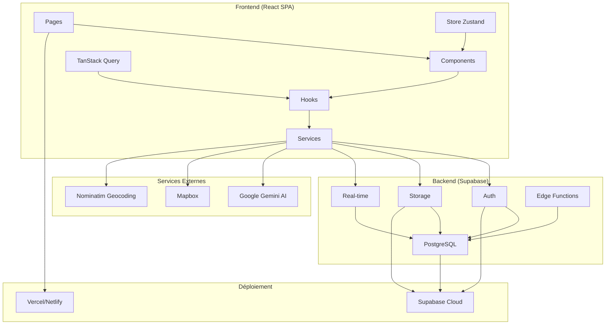

# Architecture Technique - Échangeo

## Vue d'ensemble

Échangeo suit une architecture moderne de Single Page Application (SPA) avec un backend-as-a-service. L'application est conçue pour être scalable, maintenable et performante.

## Diagramme d'Architecture



## Architecture Frontend

### Structure Modulaire

L'architecture frontend suit le pattern de composants React avec une séparation claire des responsabilités :

```
src/
├── components/          # Composants réutilisables
│   ├── ui/             # Composants UI de base (Button, Input, etc.)
│   ├── admin/          # Composants spécifiques à l'administration
│   └── ...             # Composants métier
├── pages/              # Pages de l'application
├── hooks/              # Hooks personnalisés pour la logique métier
├── services/           # Services externes et API
├── store/              # Gestion d'état global
├── types/              # Définitions TypeScript
└── utils/              # Fonctions utilitaires
```

### Gestion d'État

#### Zustand (État Global)
- **Authentification** : Utilisateur connecté, profil, permissions
- **UI State** : Modales, notifications, thèmes
- **Cache Local** : Préférences utilisateur, données temporaires

```typescript
interface AuthState {
  user: User | null;
  profile: Profile | null;
  loading: boolean;
  signUp: (email: string, password: string) => Promise<void>;
  signIn: (email: string, password: string) => Promise<void>;
  signOut: () => Promise<void>;
}
```

#### TanStack Query (État Serveur)
- **Cache intelligent** des données serveur
- **Synchronisation automatique** en arrière-plan
- **Gestion optimiste** des mutations
- **Retry automatique** en cas d'erreur

```typescript
// Exemple d'utilisation
const { data: items, isLoading, error } = useQuery({
  queryKey: ['items', filters],
  queryFn: () => fetchItems(filters),
  staleTime: 5 * 60 * 1000, // 5 minutes
});
```

### Routing et Navigation

L'application utilise React Router v6 avec une structure hiérarchique :

```typescript
// Routes principales
<Routes>
  <Route path="/" element={<LandingPage />} />
  <Route path="/login" element={<LoginPage />} />
  <Route path="/how-it-works" element={<HowItWorksPage />} />
  
  {/* Routes protégées */}
  <Route path="/app" element={<AuthGuard><AppLayout /></AuthGuard>}>
    <Route index element={<HomePage />} />
    <Route path="items" element={<ItemsPage />} />
    <Route path="items/:id" element={<ItemDetailPage />} />
    <Route path="profile" element={<MyProfilePage />} />
    <Route path="admin/*" element={<AdminGuard><AdminLayout /></AdminGuard>} />
  </Route>
</Routes>
```

### Composants et Design System

#### Composants UI de Base
- **Button** : Boutons avec variants (primary, secondary, danger)
- **Input** : Champs de saisie avec validation
- **Card** : Conteneurs de contenu
- **Badge** : Étiquettes et statuts
- **Modal** : Fenêtres modales réutilisables

#### Composants Métier
- **ItemCard** : Affichage des objets avec actions
- **FiltersPanel** : Panneau de filtres avancés
- **MessageComposer** : Composition de messages
- **CommunityCard** : Cartes de communauté

## Architecture Backend

### Supabase Backend-as-a-Service

#### Authentification
- **JWT Tokens** pour la sécurité
- **Row Level Security (RLS)** pour l'accès aux données
- **Policies** granulaires par table
- **Gestion des sessions** automatique

```sql
-- Exemple de politique RLS
CREATE POLICY "Users can view their own profile" ON profiles
FOR SELECT USING (auth.uid() = id);
```

#### Base de Données PostgreSQL
- **Tables relationnelles** avec contraintes
- **Index optimisés** pour les performances
- **Triggers** pour la cohérence des données
- **Vues** pour les requêtes complexes

#### Stockage de Fichiers
- **Buckets organisés** par type (avatars, items, etc.)
- **Upload direct** depuis le client
- **Optimisation d'images** automatique
- **CDN global** pour la performance

#### Real-time
- **Subscriptions** en temps réel
- **Notifications push** pour les interactions
- **Synchronisation** multi-appareils

### Services Externes

#### Intelligence Artificielle (Google Gemini)
- **Analyse d'images** pour la catégorisation automatique
- **Suggestions de descriptions** d'objets
- **Amélioration de messages** pour la communication
- **Détection de quartiers** à partir d'adresses

#### Géolocalisation
- **Mapbox** pour les cartes interactives
- **Nominatim** pour le reverse geocoding
- **Calcul de distances** Haversine
- **Clustering** des objets sur la carte

## Patterns Architecturaux

### Custom Hooks Pattern
Encapsulation de la logique métier dans des hooks réutilisables :

```typescript
// Hook pour la gestion des objets
export function useItems(filters?: ItemFilters) {
  return useQuery({
    queryKey: ['items', filters],
    queryFn: () => fetchItems(filters),
    enabled: !!filters,
  });
}

// Hook pour les mutations
export function useCreateItem() {
  const queryClient = useQueryClient();
  
  return useMutation({
    mutationFn: createItem,
    onSuccess: () => {
      queryClient.invalidateQueries(['items']);
    },
  });
}
```

### Service Layer Pattern
Abstraction des appels API dans des services dédiés :

```typescript
// Service pour les objets
export class ItemService {
  static async fetchItems(filters: ItemFilters): Promise<Item[]> {
    const { data, error } = await supabase
      .from('items')
      .select('*')
      .eq('is_available', true);
    
    if (error) throw error;
    return data;
  }
  
  static async createItem(item: CreateItemData): Promise<Item> {
    const { data, error } = await supabase
      .from('items')
      .insert(item)
      .select()
      .single();
    
    if (error) throw error;
    return data;
  }
}
```

### Component Composition Pattern
Composition de composants pour éviter la duplication :

```typescript
// Composant de base pour les cartes
const Card = ({ children, className, ...props }) => (
  <div className={`card ${className}`} {...props}>
    {children}
  </div>
);

// Composition pour des cartes spécialisées
const ItemCard = ({ item, ...props }) => (
  <Card className="item-card" {...props}>
    <ItemImage item={item} />
    <ItemContent item={item} />
    <ItemActions item={item} />
  </Card>
);
```

## Sécurité

### Authentification et Autorisation
- **JWT Tokens** avec expiration
- **Refresh tokens** pour la continuité de session
- **Row Level Security** au niveau base de données
- **Validation côté client et serveur**

### Protection des Données
- **Chiffrement** des données sensibles
- **Sanitisation** des entrées utilisateur
- **Rate limiting** pour prévenir les abus
- **CORS** configuré pour les domaines autorisés

### Politiques de Sécurité
```sql
-- Exemple de politique pour les objets
CREATE POLICY "Users can view available items" ON items
FOR SELECT USING (
  is_available = true AND
  (owner_id = auth.uid() OR 
   EXISTS (
     SELECT 1 FROM community_members cm 
     WHERE cm.community_id = items.community_id 
     AND cm.user_id = auth.uid()
   ))
);
```

## Performance

### Optimisations Frontend
- **Lazy loading** des composants et images
- **Virtualization** pour les longues listes
- **Memoization** des calculs coûteux
- **Code splitting** par routes

### Optimisations Backend
- **Index de base de données** optimisés
- **Pagination** pour les grandes requêtes
- **Cache Redis** pour les données fréquentes
- **CDN** pour les assets statiques

### Monitoring
- **Métriques de performance** avec Web Vitals
- **Logging structuré** pour le debugging
- **Alertes** pour les erreurs critiques
- **Analytics** pour l'usage utilisateur

## Déploiement

### Environnements
- **Développement** : Local avec Supabase local
- **Staging** : Prévisualisation des fonctionnalités
- **Production** : Environnement stable pour les utilisateurs

### CI/CD
- **Tests automatiques** à chaque commit
- **Build automatique** sur les branches
- **Déploiement automatique** sur merge
- **Rollback** en cas de problème

### Infrastructure
- **Frontend** : Vercel/Netlify (CDN global)
- **Backend** : Supabase Cloud (PostgreSQL + Auth + Storage)
- **Monitoring** : Sentry pour les erreurs
- **Analytics** : Google Analytics + Supabase Analytics

## Évolutivité

### Scalabilité Horizontale
- **Microservices** prêts pour la séparation
- **Cache distribué** avec Redis
- **Load balancing** automatique
- **Auto-scaling** basé sur la charge

### Maintenance
- **Documentation** technique complète
- **Tests** de régression automatisés
- **Monitoring** proactif
- **Backup** automatique des données

Cette architecture permet à Échangeo d'évoluer de manière flexible tout en maintenant des performances optimales et une expérience utilisateur de qualité.
