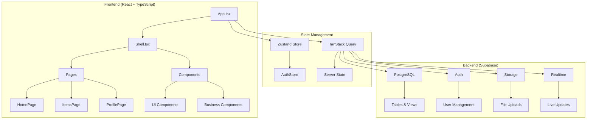
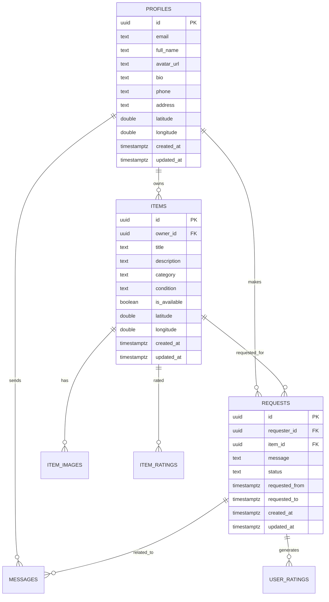
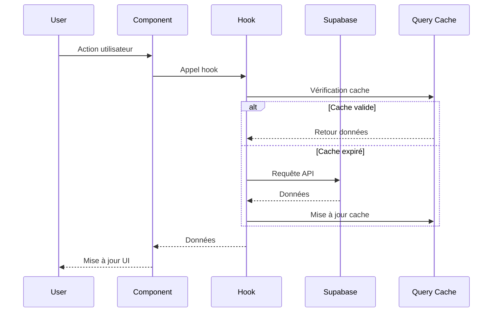

# Architecture TrocAll 🏗️

## Vue d'ensemble

TrocAll est une application web moderne construite avec une architecture **JAMstack** (JavaScript, APIs, Markup) utilisant React pour le frontend et Supabase comme Backend-as-a-Service.

## 🎯 Principes Architecturaux

- **Single Page Application (SPA)** avec React Router
- **Composants réutilisables** et modulaires
- **Séparation des responsabilités** (UI, logique métier, données)
- **Type Safety** avec TypeScript
- **State Management** hybride (Zustand + TanStack Query)
- **API-First** avec Supabase

## 🏛️ Architecture Générale



## 🎨 Frontend Architecture

### Structure des Composants

```
src/
├── components/
│   ├── ui/                 # Composants UI purs
│   │   ├── Button.tsx
│   │   ├── Card.tsx
│   │   ├── Input.tsx
│   │   └── ...
│   ├── business/           # Composants métier
│   │   ├── ItemCard.tsx
│   │   ├── MapboxMap.tsx
│   │   └── ...
│   └── layout/             # Composants de layout
│       ├── Shell.tsx
│       ├── Topbar.tsx
│       └── BottomNavigation.tsx
```

### Patterns Utilisés

#### 1. **Container/Presenter Pattern**
```typescript
// Container (logique métier)
const ItemsPage = () => {
  const { data: items, isLoading } = useItems();
  const [filters, setFilters] = useState({});
  
  return <ItemsList items={items} loading={isLoading} />;
};

// Presenter (affichage)
const ItemsList = ({ items, loading }) => {
  return <div>{/* UI pure */}</div>;
};
```

#### 2. **Custom Hooks Pattern**
```typescript
// Logique réutilisable
export const useItems = (filters) => {
  return useQuery({
    queryKey: ['items', filters],
    queryFn: () => fetchItems(filters),
  });
};
```

#### 3. **Compound Components**
```typescript
<Card>
  <Card.Header>Titre</Card.Header>
  <Card.Body>Contenu</Card.Body>
  <Card.Footer>Actions</Card.Footer>
</Card>
```

## 🗄️ Backend Architecture (Supabase)

### Base de Données



### Vues et Fonctions

#### Vues de Statistiques
```sql
-- Réputation des utilisateurs
CREATE VIEW profile_reputation_stats AS
SELECT 
  rated_user_id as profile_id,
  COUNT(*) as ratings_count,
  AVG(communication_score) as avg_communication,
  AVG(punctuality_score) as avg_punctuality,
  AVG(care_score) as avg_care,
  AVG((communication_score + punctuality_score + care_score) / 3.0) as overall_score
FROM user_ratings
GROUP BY rated_user_id;
```

#### Système de Badges
```sql
-- Badges automatiques basés sur l'activité
CREATE VIEW profile_badges AS
SELECT 
  profile_id,
  'super_lender' as badge_slug,
  'Super Prêteur' as badge_label
FROM profile_activity_counts 
WHERE completed_lends >= 10 AND overall_score >= 4.5;
```

## 🔄 State Management

### Architecture Hybride

```typescript
// 1. État Global (Zustand) - Données persistantes
const useAuthStore = create((set) => ({
  user: null,
  profile: null,
  signIn: async (email, password) => { /* ... */ },
  signOut: async () => { /* ... */ },
}));

// 2. État Serveur (TanStack Query) - Données temporaires
const { data: items } = useQuery({
  queryKey: ['items'],
  queryFn: fetchItems,
  staleTime: 5 * 60 * 1000, // 5 minutes
});
```

### Flux de Données



## 🔐 Sécurité

### Authentification
- **Supabase Auth** avec JWT
- **Row Level Security** (RLS) désactivé en MVP
- **Validation côté client** avec Zod
- **Protection des routes** avec AuthGuard

### Données Sensibles
- **Variables d'environnement** pour les clés API
- **Validation des entrées** utilisateur
- **Sanitisation** des données avant stockage

## 📱 Responsive Design

### Breakpoints
```css
/* Mobile First */
sm: 640px   /* Tablettes */
md: 768px   /* Laptops */
lg: 1024px  /* Desktops */
xl: 1280px  /* Large screens */
```

### Stratégie Mobile
- **Bottom Navigation** sur mobile
- **Floating Action Button** pour les actions principales
- **Touch-friendly** interfaces
- **Progressive Web App** ready

## 🚀 Performance

### Optimisations Frontend
- **Code Splitting** avec React.lazy()
- **Image Optimization** avec Supabase Storage
- **Bundle Analysis** avec Vite
- **Tree Shaking** automatique

### Optimisations Backend
- **Indexes** sur les colonnes fréquemment requises
- **Views** pour les requêtes complexes
- **Pagination** pour les grandes listes
- **Caching** avec TanStack Query

## 🔄 Déploiement

### Pipeline CI/CD
```yaml
# .github/workflows/deploy.yml
name: Deploy
on:
  push:
    branches: [main]
jobs:
  deploy:
    runs-on: ubuntu-latest
    steps:
      - uses: actions/checkout@v2
      - uses: actions/setup-node@v2
      - run: npm ci
      - run: npm run build
      - run: npm run test
      - uses: netlify/actions/cli@master
```

### Environnements
- **Development** : `localhost:5173`
- **Staging** : `staging.trocall.app`
- **Production** : `trocall.app`

## 📊 Monitoring

### Métriques Frontend
- **Core Web Vitals** (LCP, FID, CLS)
- **Bundle Size** monitoring
- **Error Tracking** avec console.error

### Métriques Backend
- **Supabase Dashboard** pour les requêtes
- **Database Performance** monitoring
- **Storage Usage** tracking

## 🔮 Évolutivité

### Scalabilité Horizontale
- **CDN** pour les assets statiques
- **Database Sharding** si nécessaire
- **Microservices** pour les fonctionnalités complexes

### Patterns d'Extension
- **Plugin Architecture** pour les nouvelles fonctionnalités
- **Event-Driven** pour les notifications
- **CQRS** pour les requêtes complexes

---

Cette architecture permet une évolution progressive et maintenable de l'application TrocAll. 🚀