# Architecture TrocAll 🏗️

## Vue d'ensemble

TrocAll est une application web moderne construite avec une architecture **JAMstack** (JavaScript, APIs, Markup) utilisant React pour le frontend et Supabase comme Backend-as-a-Service. L'application suit les principes de **Single Page Application (SPA)** avec une architecture modulaire et scalable.

## 🎯 Principes Architecturaux

- **Single Page Application (SPA)** avec React Router
- **Composants réutilisables** et modulaires
- **Séparation des responsabilités** (UI, logique métier, données)
- **Type Safety** avec TypeScript
- **State Management** hybride (Zustand + TanStack Query)
- **API-First** avec Supabase
- **Mobile-First** design responsive

## 🏛️ Architecture Générale


## 🎨 Frontend Architecture

### Structure des Composants

```
src/
├── components/
│   ├── ui/                 # Composants UI purs
│   │   ├── Button.tsx
│   │   ├── Card.tsx
│   │   ├── Input.tsx
│   │   ├── Select.tsx
│   │   └── TextArea.tsx
│   ├── business/           # Composants métier
│   │   ├── ItemCard.tsx
│   │   ├── MapboxMap.tsx
│   │   ├── ChatAIAssistant.tsx
│   │   ├── GamificationPage.tsx
│   │   └── NotificationSystem.tsx
│   └── layout/             # Composants de layout
│       ├── Shell.tsx
│       ├── Topbar.tsx
│       └── BottomNavigation.tsx
```

### Patterns Utilisés

#### 1. **Composition Pattern**
```typescript
// Exemple avec Shell.tsx
const Shell: React.FC<ShellProps> = ({ children }) => {
  return (
    <div className="min-h-screen bg-gray-50 flex flex-col">
      <Topbar />
      <main className="flex-1">
        <AnimatePresence mode="wait">
          <motion.div key={location.pathname}>
            {children}
          </motion.div>
        </AnimatePresence>
      </main>
      <BottomNavigation />
    </div>
  );
};
```

#### 2. **Custom Hooks Pattern**
```typescript
// Exemple avec useGamification.ts
export function useGamificationStats(profileId?: string) {
  const { user } = useAuthStore();
  const targetId = profileId || user?.id;

  return useQuery({
    queryKey: ['gamificationStats', targetId],
    queryFn: async (): Promise<GamificationStats | null> => {
      // Logique de récupération des données
    },
    enabled: !!targetId,
  });
}
```

#### 3. **Provider Pattern**
```typescript
// Configuration globale dans main.tsx
<QueryClientProvider client={queryClient}>
  <MotionConfig reducedMotion={prefersReducedMotion ? 'always' : 'never'}>
    <BrowserRouter>
      <App />
    </BrowserRouter>
  </MotionConfig>
</QueryClientProvider>
```

## 🔄 State Management

### Architecture Hybride

#### **Zustand** - État Global Client
```typescript
// authStore.ts
interface AuthState {
  user: User | null;
  profile: Profile | null;
  loading: boolean;
  signUp: (email: string, password: string) => Promise<void>;
  signIn: (email: string, password: string) => Promise<void>;
  signOut: () => Promise<void>;
}

export const useAuthStore = create<AuthState>((set, get) => ({
  // Implémentation...
}));
```

#### **TanStack Query** - État Serveur
```typescript
// useItems.ts
export function useItems() {
  return useQuery({
    queryKey: ['items'],
    queryFn: async (): Promise<Item[]> => {
      const { data, error } = await supabase
        .from('items')
        .select('*')
        .eq('is_available', true);
      
      if (error) throw error;
      return data || [];
    },
    staleTime: 1000 * 60 * 5, // 5 minutes
  });
}
```

### Flux de Données

```mermaid
sequenceDiagram
    participant U as User
    participant C as Component
    participant H as Hook
    participant S as Supabase
    participant Q as Query Cache
    
    U->>C: Action utilisateur
    C->>H: Appel hook
    H->>Q: Vérification cache
    alt Cache valide
        Q-->>H: Données cachées
    else Cache expiré
        H->>S: Requête API
        S-->>H: Données fraîches
        H->>Q: Mise à jour cache
    end
    H-->>C: Données
    C-->>U: Mise à jour UI
```



## 🗄️ Backend Architecture (Supabase)

### Structure de Base de Données


### Services Supabase Utilisés

#### 1. **Authentication**
- Gestion des utilisateurs (inscription, connexion, déconnexion)
- Sessions persistantes
- Intégration avec les profils utilisateurs

#### 2. **Database**
- PostgreSQL avec Row Level Security (RLS)
- Vues pour les statistiques complexes
- Fonctions stockées pour la logique métier

#### 3. **Storage**
- Upload d'images d'objets
- Gestion des avatars utilisateurs
- CDN intégré

#### 4. **Realtime**
- Notifications en temps réel
- Mise à jour des messages de chat
- Synchronisation des demandes

## 🤖 Services Externes

### Mistral AI Integration

```typescript
// aiService.ts
export const analyzeImageWithAI = async (
  imageFile: File,
  context?: string
): Promise<AIAnalysisResult> => {
  const base64Image = await imageToBase64(imageFile);
  
  const response = await fetch(MISTRAL_API_URL, {
    method: 'POST',
    headers: {
      'Authorization': `Bearer ${MISTRAL_API_KEY}`,
      'Content-Type': 'application/json',
    },
    body: JSON.stringify({
      model: 'mistral-large-latest',
      messages: [
        {
          role: 'user',
          content: [
            { type: 'text', text: 'Analyze this image and provide item details' },
            { type: 'image_url', image_url: { url: `data:image/jpeg;base64,${base64Image}` } }
          ]
        }
      ]
    })
  });
  
  return processAIResponse(response);
};
```

### Mapbox Integration

```typescript
// MapboxMap.tsx
const MapboxMap: React.FC<MapboxMapProps> = ({ 
  items, 
  userLocation, 
  onItemClick 
}) => {
  const mapContainer = useRef<HTMLDivElement>(null);
  const map = useRef<mapboxgl.Map | null>(null);

  useEffect(() => {
    if (map.current) return; // Initialiser la carte une seule fois
    
    map.current = new mapboxgl.Map({
      container: mapContainer.current!,
      style: 'mapbox://styles/mapbox/streets-v12',
      center: userLocation || [2.3522, 48.8566], // Paris par défaut
      zoom: 13
    });
    
    // Ajouter les marqueurs des objets
    items.forEach(item => {
      if (item.latitude && item.longitude) {
        new mapboxgl.Marker()
          .setLngLat([item.longitude, item.latitude])
          .addTo(map.current!);
      }
    });
  }, [items, userLocation]);

  return <div ref={mapContainer} className="w-full h-full rounded-lg" />;
};
```

## 🎮 Système de Gamification

### Architecture Modulaire

```typescript
// Structure du système de gamification
interface GamificationSystem {
  // Niveaux et points
  userLevels: UserLevel[];
  pointsHistory: UserPointsHistory[];
  
  // Défis et récompenses
  challenges: Challenge[];
  userChallenges: UserChallenge[];
  
  // Badges et réputation
  badges: Badge[];
  userBadges: UserBadge[];
  
  // Classements
  leaderboard: LeaderboardEntry[];
}
```

### Fonctions Stockées PostgreSQL

```sql
-- Calcul automatique des niveaux
CREATE OR REPLACE FUNCTION public.calculate_user_level(points INTEGER)
RETURNS INTEGER AS $$
BEGIN
  IF points < 100 THEN RETURN 1;
  ELSIF points < 250 THEN RETURN 2;
  -- ... logique de niveaux
  ELSE RETURN 10 + FLOOR((points - 11000) / 5000);
  END IF;
END;
$$ LANGUAGE plpgsql;

-- Attribution automatique de badges
CREATE OR REPLACE FUNCTION public.check_and_award_badges(p_profile_id UUID)
RETURNS VOID AS $$
BEGIN
  -- Vérification des critères et attribution automatique
END;
$$ LANGUAGE plpgsql;
```

## 🔒 Sécurité

### Row Level Security (RLS)

```sql
-- Exemple de politique RLS
CREATE POLICY "Users can view their own profile" ON public.profiles
  FOR SELECT USING (auth.uid() = id);

CREATE POLICY "Users can update their own profile" ON public.profiles
  FOR UPDATE USING (auth.uid() = id);
```

### Validation des Données

```typescript
// Validation avec Zod
const createItemSchema = z.object({
  title: z.string().min(1, 'Le titre est requis'),
  description: z.string().optional(),
  category: z.enum(['tools', 'electronics', 'books', 'sports', 'kitchen', 'garden', 'toys', 'other']),
  condition: z.enum(['excellent', 'good', 'fair', 'poor']),
  offer_type: z.enum(['loan', 'trade']),
  estimated_value: z.number().positive().optional(),
});
```

## 📱 Responsive Design

### Breakpoints Tailwind

```typescript
// tailwind.config.js
module.exports = {
  theme: {
    screens: {
      sm: '640px',   // Mobile large
      md: '768px',   // Tablet
      lg: '1024px',  // Desktop
      xl: '1280px',  // Desktop large
    },
  },
};
```

### Mobile-First Components

```typescript
// Shell.tsx - Navigation adaptative
const Shell: React.FC<ShellProps> = ({ children }) => {
  const isMobile = useMediaQuery('(max-width: 768px)');
  
  return (
    <div className="min-h-screen bg-gray-50 flex flex-col">
      <Topbar />
      <main className={`flex-1 ${isMobile ? 'pb-16' : ''}`}>
        {children}
      </main>
      {isMobile && <BottomNavigation />}
    </div>
  );
};
```

## 🚀 Performance

### Optimisations Implementées

1. **Code Splitting** avec Vite
2. **Lazy Loading** des composants
3. **Image Optimization** avec Supabase Storage
4. **Query Caching** avec TanStack Query
5. **Bundle Optimization** avec Vite

### Métriques de Performance

- **First Contentful Paint** : < 1.5s
- **Largest Contentful Paint** : < 2.5s
- **Cumulative Layout Shift** : < 0.1
- **Time to Interactive** : < 3.5s

## 🔄 CI/CD et Déploiement

### Pipeline de Déploiement


### Environnements

- **Development** : `localhost:5173`
- **Staging** : `staging.trocall.app`
- **Production** : `trocall.app`

## 📊 Monitoring et Analytics

### Métriques Surveillées

1. **Performance** : Core Web Vitals
2. **Erreurs** : JavaScript errors, API failures
3. **Usage** : User interactions, feature adoption
4. **Business** : Items created, successful exchanges

### Outils Utilisés

- **Supabase Analytics** pour les métriques backend
- **Vite Bundle Analyzer** pour l'optimisation du bundle
- **React DevTools** pour le debugging

---

Cette architecture garantit une application scalable, maintenable et performante, prête pour une croissance future et l'ajout de nouvelles fonctionnalités.