# Architecture TrocAll 🏗️

## Vue d'ensemble

TrocAll est une application web moderne construite avec une architecture **JAMstack** (JavaScript, APIs, Markup) utilisant React pour le frontend et Supabase comme Backend-as-a-Service. L'application suit les principes de **Single Page Application (SPA)** avec une architecture modulaire et scalable.

## 🎯 Principes Architecturaux

- **Single Page Application (SPA)** avec React Router
- **Composants réutilisables** et modulaires
- **Séparation des responsabilités** (UI, logique métier, données)
- **Type Safety** avec TypeScript
- **State Management** hybride (Zustand + TanStack Query)
- **API-First** avec Supabase
- **Mobile-First** design responsive
- **Progressive Enhancement** avec fonctionnalités optionnelles

## 🏛️ Architecture Générale


## 🎨 Frontend Architecture

### Structure des Composants

```
src/
├── components/
│   ├── ui/                 # Composants UI purs
│   │   ├── Button.tsx
│   │   ├── Card.tsx
│   │   ├── Input.tsx
│   │   ├── Select.tsx
│   │   ├── TextArea.tsx
│   │   ├── Modal.tsx
│   │   └── Toast.tsx
│   ├── business/           # Composants métier
│   │   ├── ItemCard.tsx
│   │   ├── MapboxMap.tsx
│   │   ├── ChatAIAssistant.tsx
│   │   ├── GamificationPage.tsx
│   │   ├── NotificationSystem.tsx
│   │   ├── CommunityCard.tsx
│   │   └── AdminDashboard.tsx
│   ├── admin/              # Composants d'administration
│   │   ├── AdminGuard.tsx
│   │   ├── UserManagement.tsx
│   │   ├── ItemModeration.tsx
│   │   └── CommunityManagement.tsx
│   └── layout/             # Composants de layout
│       ├── Shell.tsx
│       ├── Topbar.tsx
│       └── BottomNavigation.tsx
```

### Patterns Utilisés

#### 1. **Composition Pattern**
```typescript
// Exemple avec Shell.tsx
const Shell: React.FC<ShellProps> = ({ children }) => {
  const isMobile = useMediaQuery('(max-width: 768px)');
  
  return (
    <div className="min-h-screen bg-gray-50 flex flex-col">
      <Topbar />
      <main className={`flex-1 ${isMobile ? 'pb-16' : ''}`}>
        <AnimatePresence mode="wait">
          <motion.div key={location.pathname}>
            {children}
          </motion.div>
        </AnimatePresence>
      </main>
      {isMobile && <BottomNavigation />}
    </div>
  );
};
```

#### 2. **Custom Hooks Pattern**
```typescript
// Exemple avec useGamification.ts
export function useGamificationStats(profileId?: string) {
  const { user } = useAuthStore();
  const targetId = profileId || user?.id;

  return useQuery({
    queryKey: ['gamificationStats', targetId],
    queryFn: async (): Promise<GamificationStats | null> => {
      const { data, error } = await supabase
        .from('gamification_stats')
        .select('*')
        .eq('profile_id', targetId)
        .single();
      
      if (error) throw error;
      return data;
    },
    enabled: !!targetId,
  });
}
```

#### 3. **Provider Pattern**
```typescript
// Configuration globale dans main.tsx
<QueryClientProvider client={queryClient}>
  <MotionConfig reducedMotion={prefersReducedMotion ? 'always' : 'never'}>
    <BrowserRouter>
      <App />
    </BrowserRouter>
  </MotionConfig>
</QueryClientProvider>
```

#### 4. **Guard Pattern**
```typescript
// Exemple avec AdminGuard.tsx
const AdminGuard: React.FC<AdminGuardProps> = ({ 
  children, 
  requiredPermission 
}) => {
  const { user, profile } = useAuthStore();
  const { data: adminProfile } = useAdmin();

  if (!user || !adminProfile?.is_admin) {
    return <Navigate to="/" replace />;
  }

  if (requiredPermission && !adminProfile.permissions[requiredPermission]) {
    return <Navigate to="/admin" replace />;
  }

  return <>{children}</>;
};
```

## 🔄 State Management

### Architecture Hybride

#### **Zustand** - État Global Client
```typescript
// authStore.ts
interface AuthState {
  user: User | null;
  profile: Profile | null;
  loading: boolean;
  signUp: (email: string, password: string) => Promise<void>;
  signIn: (email: string, password: string) => Promise<void>;
  signOut: () => Promise<void>;
  updateProfile: (updates: Partial<Profile>) => Promise<void>;
}

export const useAuthStore = create<AuthState>((set, get) => ({
  user: null,
  profile: null,
  loading: true,
  
  signIn: async (email: string, password: string) => {
    const { data, error } = await supabase.auth.signInWithPassword({
      email,
      password,
    });

    if (error) throw error;

    // Vérifier si l'utilisateur est banni
    if (data.user) {
      const { data: banStatus } = await supabase.rpc('is_user_banned', {
        target_user_id: data.user.id
      });

      if (banStatus) {
        await supabase.auth.signOut();
        throw new Error('Votre compte a été suspendu.');
      }
    }
  },
}));
```

#### **TanStack Query** - État Serveur
```typescript
// useItems.ts
export function useItems() {
  return useQuery({
    queryKey: ['items'],
    queryFn: async (): Promise<Item[]> => {
      const { data, error } = await supabase
        .from('items')
        .select(`
          *,
          owner:profiles(*),
          images:item_images(*)
        `)
        .eq('is_available', true)
        .order('created_at', { ascending: false });
      
      if (error) throw error;
      return data || [];
    },
    staleTime: 1000 * 60 * 5, // 5 minutes
    retry: 1,
  });
}
```

### Flux de Données

```mermaid
sequenceDiagram
    participant U as User
    participant C as Component
    participant H as Hook
    participant S as Supabase
    participant Q as Query Cache
    
    U->>C: Action utilisateur
    C->>H: Appel hook
    H->>Q: Vérification cache
    alt Cache valide
        Q-->>H: Données cachées
    else Cache expiré
        H->>S: Requête API
        S-->>H: Données fraîches
        H->>Q: Mise à jour cache
    end
    H-->>C: Données
    C-->>U: Mise à jour UI
```



## 🗄️ Backend Architecture (Supabase)

### Structure de Base de Données


### Services Supabase Utilisés

#### 1. **Authentication**
- Gestion des utilisateurs (inscription, connexion, déconnexion)
- Sessions persistantes avec refresh automatique
- Intégration avec les profils utilisateurs
- Système de bannissement et suspension

#### 2. **Database**
- PostgreSQL avec Row Level Security (RLS)
- Vues pour les statistiques complexes
- Fonctions stockées pour la logique métier
- Triggers pour les mises à jour automatiques
- Index optimisés pour les performances

#### 3. **Storage**
- Upload d'images d'objets avec compression
- Gestion des avatars utilisateurs
- CDN intégré avec cache
- Politiques de sécurité par bucket

#### 4. **Realtime**
- Notifications en temps réel
- Mise à jour des messages de chat
- Synchronisation des demandes
- Suivi des événements communautaires

#### 5. **Edge Functions**
- Logique serveur personnalisée
- Intégration avec services externes
- Traitement des webhooks
- Analytics et reporting

## 🤖 Services Externes

### Gemini AI Integration

```typescript
// aiService.ts
export const analyzeImageWithAI = async (file: File): Promise<AIAnalysisResult> => {
  const apiKey = import.meta.env.VITE_GEMINI_API_KEY;
  
  if (!apiKey) {
    throw new Error('Clé API Gemini manquante');
  }

  const base64Image = await imageToBase64(file);
  
  const response = await fetch(`${GEMINI_API_URL}?key=${apiKey}`, {
    method: 'POST',
    headers: {
      'Content-Type': 'application/json',
    },
    body: JSON.stringify({
      contents: [
        {
          parts: [
            { text: 'Analyze this image and provide item details' },
            {
              inline_data: {
                mime_type: file.type,
                data: base64Image
              }
            }
          ]
        }
      ],
      generationConfig: {
        maxOutputTokens: 1000,
        temperature: 0.1,
      },
    }),
  });

  return processAIResponse(response);
};
```

### Mapbox Integration

```typescript
// MapboxMap.tsx
const MapboxMap: React.FC<MapboxMapProps> = ({ 
  items, 
  userLocation, 
  onItemClick 
}) => {
  const mapContainer = useRef<HTMLDivElement>(null);
  const map = useRef<mapboxgl.Map | null>(null);

  useEffect(() => {
    if (map.current) return;
    
    map.current = new mapboxgl.Map({
      container: mapContainer.current!,
      style: 'mapbox://styles/mapbox/streets-v12',
      center: userLocation || [2.3522, 48.8566], // Paris par défaut
      zoom: 13
    });
    
    // Ajouter les marqueurs des objets
    items.forEach(item => {
      if (item.latitude && item.longitude) {
        const marker = new mapboxgl.Marker()
          .setLngLat([item.longitude, item.latitude])
          .addTo(map.current!);
        
        marker.getElement().addEventListener('click', () => {
          onItemClick(item.id);
        });
      }
    });
  }, [items, userLocation]);

  return <div ref={mapContainer} className="w-full h-full rounded-lg" />;
};
```

## 🎮 Système de Gamification

### Architecture Modulaire

```typescript
// Structure du système de gamification
interface GamificationSystem {
  // Niveaux et points
  userLevels: UserLevel[];
  pointsHistory: UserPointsHistory[];
  
  // Défis et récompenses
  challenges: Challenge[];
  userChallenges: UserChallenge[];
  
  // Badges et réputation
  badges: Badge[];
  userBadges: UserBadge[];
  
  // Classements
  leaderboard: LeaderboardEntry[];
  
  // Statistiques
  stats: GamificationStats;
}
```

### Fonctions Stockées PostgreSQL

```sql
-- Calcul automatique des niveaux
CREATE OR REPLACE FUNCTION public.calculate_user_level(points INTEGER)
RETURNS INTEGER AS $$
BEGIN
  IF points < 100 THEN RETURN 1;
  ELSIF points < 250 THEN RETURN 2;
  ELSIF points < 500 THEN RETURN 3;
  ELSIF points < 1000 THEN RETURN 4;
  ELSIF points < 2000 THEN RETURN 5;
  ELSIF points < 5000 THEN RETURN 6;
  ELSIF points < 10000 THEN RETURN 7;
  ELSIF points < 20000 THEN RETURN 8;
  ELSIF points < 50000 THEN RETURN 9;
  ELSE RETURN 10 + FLOOR((points - 50000) / 10000);
  END IF;
END;
$$ LANGUAGE plpgsql;

-- Attribution automatique de badges
CREATE OR REPLACE FUNCTION public.check_and_award_badges(p_profile_id UUID)
RETURNS VOID AS $$
BEGIN
  -- Vérification des critères et attribution automatique
  -- Logique complexe pour différents types de badges
END;
$$ LANGUAGE plpgsql;
```

## 🏘️ Système de Communautés

### Architecture Géographique

```typescript
// Structure des communautés
interface Community {
  id: string;
  name: string;
  description?: string;
  city: string;
  postal_code?: string;
  country: string;
  center_latitude?: number;
  center_longitude?: number;
  radius_km: number;
  is_active: boolean;
  activity_level?: 'active' | 'moderate' | 'inactive';
  created_by?: string;
  created_at: string;
  updated_at: string;
  
  // Relations
  stats?: CommunityStats;
  members?: CommunityMember[];
  events?: CommunityEvent[];
  discussions?: CommunityDiscussion[];
}
```

### Fonctions Géographiques

```sql
-- Calcul de distance entre deux points
CREATE OR REPLACE FUNCTION calculate_distance_km(
    lat1 DOUBLE PRECISION,
    lon1 DOUBLE PRECISION,
    lat2 DOUBLE PRECISION,
    lon2 DOUBLE PRECISION
)
RETURNS DOUBLE PRECISION AS $$
DECLARE
    R DOUBLE PRECISION := 6371; -- Rayon de la Terre en km
    dLat DOUBLE PRECISION;
    dLon DOUBLE PRECISION;
    a DOUBLE PRECISION;
    c DOUBLE PRECISION;
BEGIN
    dLat := radians(lat2 - lat1);
    dLon := radians(lon2 - lon1);
    
    a := sin(dLat/2) * sin(dLat/2) + cos(radians(lat1)) * cos(radians(lat2)) * sin(dLon/2) * sin(dLon/2);
    c := 2 * atan2(sqrt(a), sqrt(1-a));
    
    RETURN R * c;
END;
$$ LANGUAGE plpgsql;

-- Trouver les communautés proches
CREATE OR REPLACE FUNCTION find_nearby_communities(
    p_latitude DOUBLE PRECISION,
    p_longitude DOUBLE PRECISION,
    p_radius_km INTEGER DEFAULT 10
)
RETURNS TABLE (
    community_id UUID,
    community_name TEXT,
    distance_km DOUBLE PRECISION,
    member_count INTEGER
) AS $$
BEGIN
    RETURN QUERY
    SELECT 
        c.id,
        c.name,
        calculate_distance_km(p_latitude, p_longitude, c.center_latitude, c.center_longitude) as distance_km,
        COALESCE(cs.total_members, 0) as member_count
    FROM communities c
    LEFT JOIN community_stats cs ON cs.community_id = c.id
    WHERE c.is_active = true
    AND c.center_latitude IS NOT NULL 
    AND c.center_longitude IS NOT NULL
    AND calculate_distance_km(p_latitude, p_longitude, c.center_latitude, c.center_longitude) <= p_radius_km
    ORDER BY distance_km;
END;
$$ LANGUAGE plpgsql;
```

## 🔒 Sécurité

### Row Level Security (RLS)

```sql
-- Exemple de politique RLS pour les profils
CREATE POLICY "Users can view their own profile" ON public.profiles
  FOR SELECT USING (auth.uid() = id);

CREATE POLICY "Users can update their own profile" ON public.profiles
  FOR UPDATE USING (auth.uid() = id);

-- Politique pour les objets
CREATE POLICY "Users can view available items" ON public.items
  FOR SELECT USING (is_available = true);

CREATE POLICY "Users can manage their own items" ON public.items
  FOR ALL USING (auth.uid() = owner_id);

-- Politique pour les communautés
CREATE POLICY "Users can view active communities" ON public.communities
  FOR SELECT USING (is_active = true);
```

### Validation des Données

```typescript
// Validation avec Zod
const createItemSchema = z.object({
  title: z.string().min(1, 'Le titre est requis').max(80, 'Titre trop long'),
  description: z.string().max(500, 'Description trop longue').optional(),
  category: z.enum(['tools', 'electronics', 'books', 'sports', 'kitchen', 'garden', 'toys', 'fashion', 'furniture', 'music', 'baby', 'art', 'beauty', 'auto', 'office', 'services', 'other']),
  condition: z.enum(['excellent', 'good', 'fair', 'poor']),
  offer_type: z.enum(['loan', 'trade']),
  estimated_value: z.number().positive().max(100000).optional(),
  tags: z.array(z.string()).max(10).optional(),
});

// Validation côté serveur avec fonctions stockées
CREATE OR REPLACE FUNCTION validate_item_data(
    p_title TEXT,
    p_category TEXT,
    p_condition TEXT
)
RETURNS BOOLEAN AS $$
BEGIN
    -- Validation des données
    IF p_title IS NULL OR LENGTH(p_title) = 0 THEN
        RETURN FALSE;
    END IF;
    
    IF p_category NOT IN ('tools', 'electronics', 'books', 'sports', 'kitchen', 'garden', 'toys', 'fashion', 'furniture', 'music', 'baby', 'art', 'beauty', 'auto', 'office', 'services', 'other') THEN
        RETURN FALSE;
    END IF;
    
    RETURN TRUE;
END;
$$ LANGUAGE plpgsql;
```

## 📱 Responsive Design

### Breakpoints Tailwind

```typescript
// tailwind.config.js
module.exports = {
  theme: {
    screens: {
      sm: '640px',   // Mobile large
      md: '768px',   // Tablet
      lg: '1024px',  // Desktop
      xl: '1280px',  // Desktop large
    },
  },
};
```

### Mobile-First Components

```typescript
// Shell.tsx - Navigation adaptative
const Shell: React.FC<ShellProps> = ({ children }) => {
  const isMobile = useMediaQuery('(max-width: 768px)');
  
  return (
    <div className="min-h-screen bg-gray-50 flex flex-col">
      <Topbar />
      <main className={`flex-1 ${isMobile ? 'pb-16' : ''}`}>
        {children}
      </main>
      {isMobile && <BottomNavigation />}
      
      {/* Actions flottantes pour mobile */}
      {isMobile && (
        <div className="fixed right-4 bottom-20 z-50 flex flex-col gap-2">
          <button onClick={() => navigate('/create')}>
            <Plus className="w-6 h-6" />
          </button>
        </div>
      )}
    </div>
  );
};
```

## 🚀 Performance

### Optimisations Implementées

1. **Code Splitting** avec Vite
2. **Lazy Loading** des composants
3. **Image Optimization** avec Supabase Storage
4. **Query Caching** avec TanStack Query
5. **Bundle Optimization** avec Vite
6. **Service Worker** pour le cache offline
7. **Preloading** des routes critiques

### Métriques de Performance

- **First Contentful Paint** : < 1.5s
- **Largest Contentful Paint** : < 2.5s
- **Cumulative Layout Shift** : < 0.1
- **Time to Interactive** : < 3.5s
- **Core Web Vitals** : Tous dans le vert

## 🔄 CI/CD et Déploiement

### Pipeline de Déploiement


### Environnements

- **Development** : `localhost:5173`
- **Staging** : `staging.trocall.app`
- **Production** : `trocall.app`

## 📊 Monitoring et Analytics

### Métriques Surveillées

1. **Performance** : Core Web Vitals
2. **Erreurs** : JavaScript errors, API failures
3. **Usage** : User interactions, feature adoption
4. **Business** : Items created, successful exchanges
5. **Communautés** : Activity levels, member growth

### Outils Utilisés

- **Supabase Analytics** pour les métriques backend
- **Vite Bundle Analyzer** pour l'optimisation du bundle
- **React DevTools** pour le debugging
- **Sentry** pour le monitoring des erreurs
- **Google Analytics** pour les métriques business

## 🔧 Administration

### Architecture Admin

```typescript
// Structure de l'administration
interface AdminSystem {
  // Gestion des utilisateurs
  userManagement: {
    banUsers: (userId: string, reason: string) => Promise<void>;
    suspendUsers: (userId: string, duration: number) => Promise<void>;
    viewUserStats: (userId: string) => Promise<UserStats>;
  };
  
  // Gestion des objets
  itemManagement: {
    moderateItems: (itemId: string, action: 'approve' | 'reject') => Promise<void>;
    suspendItems: (itemId: string, reason: string) => Promise<void>;
    viewItemReports: () => Promise<ItemReport[]>;
  };
  
  // Gestion des communautés
  communityManagement: {
    approveCommunities: (communityId: string) => Promise<void>;
    moderateDiscussions: (discussionId: string, action: string) => Promise<void>;
    viewCommunityStats: () => Promise<CommunityStats[]>;
  };
  
  // Analytics
  analytics: {
    getGlobalStats: () => Promise<GlobalStats>;
    getUserGrowth: (period: string) => Promise<GrowthData>;
    getExchangeStats: () => Promise<ExchangeStats>;
  };
}
```

---

Cette architecture garantit une application scalable, maintenable et performante, prête pour une croissance future et l'ajout de nouvelles fonctionnalités. L'approche modulaire permet une évolution progressive tout en maintenant la cohérence et la qualité du code.