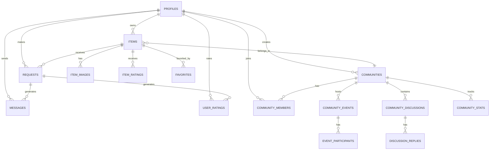

# Schéma de Base de Données Échangeo 🗄️

## Vue d'ensemble

Échangeo utilise **PostgreSQL** via Supabase comme base de données principale. Ce document décrit la structure complète de la base de données, les relations entre les tables et les politiques de sécurité.

## Diagramme Entité-Relation



## Tables Principales

### 👤 PROFILES - Profils Utilisateurs

**Description** : Stocke les informations des utilisateurs de la plateforme.

| Colonne | Type | Contraintes | Description |
|---------|------|-------------|-------------|
| `id` | `uuid` | PK, FK → auth.users | Identifiant unique (lié à Supabase Auth) |
| `email` | `text` | UNIQUE, NOT NULL | Adresse email de l'utilisateur |
| `full_name` | `text` | | Nom complet de l'utilisateur |
| `avatar_url` | `text` | | URL de l'avatar (stocké dans Supabase Storage) |
| `bio` | `text` | | Biographie de l'utilisateur |
| `phone` | `text` | | Numéro de téléphone |
| `address` | `text` | | Adresse complète |
| `latitude` | `double precision` | | Coordonnée GPS latitude |
| `longitude` | `double precision` | | Coordonnée GPS longitude |
| `created_at` | `timestamptz` | DEFAULT now() | Date de création |
| `updated_at` | `timestamptz` | DEFAULT now() | Date de dernière modification |

**Index** :
```sql
CREATE INDEX idx_profiles_location ON profiles USING GIST (point(longitude, latitude));
CREATE INDEX idx_profiles_email ON profiles(email);
```

**Triggers** :
```sql
CREATE TRIGGER update_profiles_updated_at 
  BEFORE UPDATE ON profiles 
  FOR EACH ROW EXECUTE FUNCTION update_updated_at_column();
```

### 📦 ITEMS - Objets à Échanger

**Description** : Contient tous les objets proposés par les utilisateurs.

| Colonne | Type | Contraintes | Description |
|---------|------|-------------|-------------|
| `id` | `uuid` | PK, DEFAULT uuid_generate_v4() | Identifiant unique |
| `owner_id` | `uuid` | FK → profiles(id), NOT NULL | Propriétaire de l'objet |
| `title` | `text` | NOT NULL | Titre de l'annonce |
| `description` | `text` | | Description détaillée |
| `category` | `text` | CHECK constraint | Catégorie de l'objet |
| `condition` | `text` | CHECK constraint | État de l'objet |
| `offer_type` | `text` | CHECK constraint | Type d'offre (prêt, échange, don) |
| `desired_items` | `text` | | Objets souhaités en échange |
| `brand` | `text` | | Marque de l'objet |
| `model` | `text` | | Modèle de l'objet |
| `estimated_value` | `numeric` | | Valeur estimée en euros |
| `tags` | `text[]` | | Tags associés |
| `available_from` | `timestamptz` | | Date de disponibilité |
| `available_to` | `timestamptz` | | Date de fin de disponibilité |
| `location_hint` | `text` | | Indication de localisation |
| `latitude` | `double precision` | | Coordonnée GPS latitude |
| `longitude` | `double precision` | | Coordonnée GPS longitude |
| `community_id` | `uuid` | FK → communities(id) | Communauté associée |
| `is_available` | `boolean` | DEFAULT true | Disponibilité de l'objet |
| `suspended_by_admin` | `boolean` | DEFAULT false | Suspension par admin |
| `suspension_reason` | `text` | | Raison de la suspension |
| `created_at` | `timestamptz` | DEFAULT now() | Date de création |
| `updated_at` | `timestamptz` | DEFAULT now() | Date de modification |

**Contraintes CHECK** :
```sql
-- Catégories autorisées
category IN ('tools', 'electronics', 'books', 'sports', 'kitchen', 'garden', 'toys', 'fashion', 'furniture', 'music', 'baby', 'art', 'beauty', 'auto', 'office', 'services', 'other')

-- États autorisés
condition IN ('excellent', 'good', 'fair', 'poor')

-- Types d'offre autorisés
offer_type IN ('loan', 'trade', 'donation')
```

**Index** :
```sql
CREATE INDEX idx_items_location ON items USING GIST (point(longitude, latitude));
CREATE INDEX idx_items_category ON items(category);
CREATE INDEX idx_items_available ON items(is_available) WHERE is_available = true;
CREATE INDEX idx_items_owner ON items(owner_id);
CREATE INDEX idx_items_community ON items(community_id);
```

### 🖼️ ITEM_IMAGES - Images des Objets

**Description** : Stocke les URLs des images associées aux objets.

| Colonne | Type | Contraintes | Description |
|---------|------|-------------|-------------|
| `id` | `uuid` | PK, DEFAULT uuid_generate_v4() | Identifiant unique |
| `item_id` | `uuid` | FK → items(id), NOT NULL | Objet associé |
| `url` | `text` | NOT NULL | URL de l'image (Supabase Storage) |
| `is_primary` | `boolean` | DEFAULT false | Image principale |
| `created_at` | `timestamptz` | DEFAULT now() | Date de création |

**Index** :
```sql
CREATE INDEX idx_item_images_item ON item_images(item_id);
CREATE INDEX idx_item_images_primary ON item_images(is_primary) WHERE is_primary = true;
```

### 📝 REQUESTS - Demandes d'Échange

**Description** : Gère les demandes d'emprunt, d'échange ou de don.

| Colonne | Type | Contraintes | Description |
|---------|------|-------------|-------------|
| `id` | `uuid` | PK, DEFAULT uuid_generate_v4() | Identifiant unique |
| `requester_id` | `uuid` | FK → profiles(id), NOT NULL | Demandeur |
| `item_id` | `uuid` | FK → items(id), NOT NULL | Objet demandé |
| `message` | `text` | | Message du demandeur |
| `status` | `text` | CHECK constraint, DEFAULT 'pending' | Statut de la demande |
| `requested_from` | `timestamptz` | | Date de début souhaitée |
| `requested_to` | `timestamptz` | | Date de fin souhaitée |
| `created_at` | `timestamptz` | DEFAULT now() | Date de création |
| `updated_at` | `timestamptz` | DEFAULT now() | Date de modification |

**Contraintes CHECK** :
```sql
status IN ('pending', 'approved', 'rejected', 'completed')
```

**Index** :
```sql
CREATE INDEX idx_requests_requester ON requests(requester_id);
CREATE INDEX idx_requests_item ON requests(item_id);
CREATE INDEX idx_requests_status ON requests(status);
```

### 💬 MESSAGES - Système de Messagerie

**Description** : Messages entre utilisateurs liés aux demandes.

| Colonne | Type | Contraintes | Description |
|---------|------|-------------|-------------|
| `id` | `uuid` | PK, DEFAULT uuid_generate_v4() | Identifiant unique |
| `sender_id` | `uuid` | FK → profiles(id), NOT NULL | Expéditeur |
| `receiver_id` | `uuid` | FK → profiles(id), NOT NULL | Destinataire |
| `content` | `text` | NOT NULL | Contenu du message |
| `request_id` | `uuid` | FK → requests(id) | Demande associée (optionnel) |
| `created_at` | `timestamptz` | DEFAULT now() | Date de création |

**Index** :
```sql
CREATE INDEX idx_messages_sender ON messages(sender_id);
CREATE INDEX idx_messages_receiver ON messages(receiver_id);
CREATE INDEX idx_messages_request ON messages(request_id);
CREATE INDEX idx_messages_created ON messages(created_at);
```

### ⭐ ITEM_RATINGS - Évaluations des Objets

**Description** : Notes et commentaires sur les objets après utilisation.

| Colonne | Type | Contraintes | Description |
|---------|------|-------------|-------------|
| `id` | `uuid` | PK, DEFAULT uuid_generate_v4() | Identifiant unique |
| `item_id` | `uuid` | FK → items(id), NOT NULL | Objet évalué |
| `rater_id` | `uuid` | FK → profiles(id), NOT NULL | Évaluateur |
| `score` | `integer` | CHECK (score >= 1 AND score <= 5) | Note de 1 à 5 |
| `comment` | `text` | | Commentaire |
| `created_at` | `timestamptz` | DEFAULT now() | Date de création |

**Index** :
```sql
CREATE INDEX idx_item_ratings_item ON item_ratings(item_id);
CREATE INDEX idx_item_ratings_rater ON item_ratings(rater_id);
```

### 👥 USER_RATINGS - Évaluations des Utilisateurs

**Description** : Évaluations des utilisateurs après interaction.

| Colonne | Type | Contraintes | Description |
|---------|------|-------------|-------------|
| `id` | `uuid` | PK, DEFAULT uuid_generate_v4() | Identifiant unique |
| `request_id` | `uuid` | FK → requests(id), NOT NULL | Demande associée |
| `rater_id` | `uuid` | FK → profiles(id), NOT NULL | Évaluateur |
| `rated_user_id` | `uuid` | FK → profiles(id), NOT NULL | Utilisateur évalué |
| `communication_score` | `integer` | CHECK (score >= 1 AND score <= 5) | Note communication |
| `punctuality_score` | `integer` | CHECK (score >= 1 AND score <= 5) | Note ponctualité |
| `care_score` | `integer` | CHECK (score >= 1 AND score <= 5) | Note soin |
| `comment` | `text` | | Commentaire |
| `created_at` | `timestamptz` | DEFAULT now() | Date de création |

**Index** :
```sql
CREATE INDEX idx_user_ratings_rater ON user_ratings(rater_id);
CREATE INDEX idx_user_ratings_rated ON user_ratings(rated_user_id);
CREATE INDEX idx_user_ratings_request ON user_ratings(request_id);
```

### ❤️ FAVORITES - Favoris des Utilisateurs

**Description** : Objets mis en favoris par les utilisateurs.

| Colonne | Type | Contraintes | Description |
|---------|------|-------------|-------------|
| `id` | `uuid` | PK, DEFAULT uuid_generate_v4() | Identifiant unique |
| `user_id` | `uuid` | FK → profiles(id), NOT NULL | Utilisateur |
| `item_id` | `uuid` | FK → items(id), NOT NULL | Objet favori |
| `created_at` | `timestamptz` | DEFAULT now() | Date de création |

**Contraintes** :
```sql
UNIQUE(user_id, item_id) -- Un utilisateur ne peut favoriser un objet qu'une fois
```

**Index** :
```sql
CREATE INDEX idx_favorites_user ON favorites(user_id);
CREATE INDEX idx_favorites_item ON favorites(item_id);
```

## Tables Communautaires

### 🏘️ COMMUNITIES - Communautés de Quartier

**Description** : Communautés géographiques d'utilisateurs.

| Colonne | Type | Contraintes | Description |
|---------|------|-------------|-------------|
| `id` | `uuid` | PK, DEFAULT uuid_generate_v4() | Identifiant unique |
| `name` | `text` | NOT NULL | Nom de la communauté |
| `description` | `text` | | Description |
| `city` | `text` | NOT NULL | Ville |
| `postal_code` | `text` | | Code postal |
| `country` | `text` | DEFAULT 'France' | Pays |
| `center_latitude` | `double precision` | | Latitude du centre |
| `center_longitude` | `double precision` | | Longitude du centre |
| `radius_km` | `numeric` | DEFAULT 5 | Rayon en kilomètres |
| `is_active` | `boolean` | DEFAULT true | Communauté active |
| `activity_level` | `text` | | Niveau d'activité |
| `created_by` | `uuid` | FK → profiles(id) | Créateur |
| `created_at` | `timestamptz` | DEFAULT now() | Date de création |
| `updated_at` | `timestamptz` | DEFAULT now() | Date de modification |

**Index** :
```sql
CREATE INDEX idx_communities_location ON communities USING GIST (point(center_longitude, center_latitude));
CREATE INDEX idx_communities_city ON communities(city);
CREATE INDEX idx_communities_active ON communities(is_active) WHERE is_active = true;
```

### 👥 COMMUNITY_MEMBERS - Membres des Communautés

**Description** : Relation entre utilisateurs et communautés.

| Colonne | Type | Contraintes | Description |
|---------|------|-------------|-------------|
| `id` | `uuid` | PK, DEFAULT uuid_generate_v4() | Identifiant unique |
| `community_id` | `uuid` | FK → communities(id), NOT NULL | Communauté |
| `user_id` | `uuid` | FK → profiles(id), NOT NULL | Utilisateur |
| `role` | `text` | CHECK constraint, DEFAULT 'member' | Rôle dans la communauté |
| `joined_at` | `timestamptz` | DEFAULT now() | Date d'adhésion |
| `is_active` | `boolean` | DEFAULT true | Membre actif |

**Contraintes CHECK** :
```sql
role IN ('member', 'moderator', 'admin')
```

**Contraintes UNIQUE** :
```sql
UNIQUE(community_id, user_id) -- Un utilisateur ne peut être membre qu'une fois par communauté
```

**Index** :
```sql
CREATE INDEX idx_community_members_community ON community_members(community_id);
CREATE INDEX idx_community_members_user ON community_members(user_id);
CREATE INDEX idx_community_members_active ON community_members(is_active) WHERE is_active = true;
```

### 📅 COMMUNITY_EVENTS - Événements Communautaires

**Description** : Événements organisés par les communautés.

| Colonne | Type | Contraintes | Description |
|---------|------|-------------|-------------|
| `id` | `uuid` | PK, DEFAULT uuid_generate_v4() | Identifiant unique |
| `community_id` | `uuid` | FK → communities(id), NOT NULL | Communauté organisatrice |
| `title` | `text` | NOT NULL | Titre de l'événement |
| `description` | `text` | | Description |
| `event_type` | `text` | CHECK constraint | Type d'événement |
| `location` | `text` | | Lieu de l'événement |
| `latitude` | `double precision` | | Coordonnée GPS latitude |
| `longitude` | `double precision` | | Coordonnée GPS longitude |
| `start_date` | `timestamptz` | NOT NULL | Date de début |
| `end_date` | `timestamptz` | | Date de fin |
| `max_participants` | `integer` | | Nombre maximum de participants |
| `created_by` | `uuid` | FK → profiles(id) | Créateur |
| `is_active` | `boolean` | DEFAULT true | Événement actif |
| `created_at` | `timestamptz` | DEFAULT now() | Date de création |
| `updated_at` | `timestamptz` | DEFAULT now() | Date de modification |

**Contraintes CHECK** :
```sql
event_type IN ('meetup', 'swap', 'workshop', 'social', 'other')
```

**Index** :
```sql
CREATE INDEX idx_community_events_community ON community_events(community_id);
CREATE INDEX idx_community_events_start_date ON community_events(start_date);
CREATE INDEX idx_community_events_active ON community_events(is_active) WHERE is_active = true;
```

### 🎫 EVENT_PARTICIPANTS - Participants aux Événements

**Description** : Participants aux événements communautaires.

| Colonne | Type | Contraintes | Description |
|---------|------|-------------|-------------|
| `id` | `uuid` | PK, DEFAULT uuid_generate_v4() | Identifiant unique |
| `event_id` | `uuid` | FK → community_events(id), NOT NULL | Événement |
| `user_id` | `uuid` | FK → profiles(id), NOT NULL | Participant |
| `status` | `text` | CHECK constraint, DEFAULT 'registered' | Statut de participation |
| `registered_at` | `timestamptz` | DEFAULT now() | Date d'inscription |

**Contraintes CHECK** :
```sql
status IN ('registered', 'confirmed', 'cancelled')
```

**Contraintes UNIQUE** :
```sql
UNIQUE(event_id, user_id) -- Un utilisateur ne peut s'inscrire qu'une fois par événement
```

**Index** :
```sql
CREATE INDEX idx_event_participants_event ON event_participants(event_id);
CREATE INDEX idx_event_participants_user ON event_participants(user_id);
CREATE INDEX idx_event_participants_status ON event_participants(status);
```

### 💬 COMMUNITY_DISCUSSIONS - Discussions Communautaires

**Description** : Forums de discussion par communauté.

| Colonne | Type | Contraintes | Description |
|---------|------|-------------|-------------|
| `id` | `uuid` | PK, DEFAULT uuid_generate_v4() | Identifiant unique |
| `community_id` | `uuid` | FK → communities(id), NOT NULL | Communauté |
| `title` | `text` | NOT NULL | Titre de la discussion |
| `content` | `text` | | Contenu initial |
| `author_id` | `uuid` | FK → profiles(id) | Auteur |
| `category` | `text` | CHECK constraint, DEFAULT 'general' | Catégorie |
| `is_pinned` | `boolean` | DEFAULT false | Discussion épinglée |
| `is_locked` | `boolean` | DEFAULT false | Discussion verrouillée |
| `created_at` | `timestamptz` | DEFAULT now() | Date de création |
| `updated_at` | `timestamptz` | DEFAULT now() | Date de modification |

**Contraintes CHECK** :
```sql
category IN ('general', 'items', 'events', 'help', 'announcements')
```

**Index** :
```sql
CREATE INDEX idx_community_discussions_community ON community_discussions(community_id);
CREATE INDEX idx_community_discussions_category ON community_discussions(category);
CREATE INDEX idx_community_discussions_pinned ON community_discussions(is_pinned) WHERE is_pinned = true;
```

### 💭 DISCUSSION_REPLIES - Réponses aux Discussions

**Description** : Réponses dans les discussions communautaires.

| Colonne | Type | Contraintes | Description |
|---------|------|-------------|-------------|
| `id` | `uuid` | PK, DEFAULT uuid_generate_v4() | Identifiant unique |
| `discussion_id` | `uuid` | FK → community_discussions(id), NOT NULL | Discussion |
| `author_id` | `uuid` | FK → profiles(id) | Auteur |
| `content` | `text` | NOT NULL | Contenu de la réponse |
| `parent_reply_id` | `uuid` | FK → discussion_replies(id) | Réponse parent (pour les sous-réponses) |
| `created_at` | `timestamptz` | DEFAULT now() | Date de création |
| `updated_at` | `timestamptz` | DEFAULT now() | Date de modification |

**Index** :
```sql
CREATE INDEX idx_discussion_replies_discussion ON discussion_replies(discussion_id);
CREATE INDEX idx_discussion_replies_author ON discussion_replies(author_id);
CREATE INDEX idx_discussion_replies_parent ON discussion_replies(parent_reply_id);
```

### 📊 COMMUNITY_STATS - Statistiques des Communautés

**Description** : Statistiques d'activité des communautés.

| Colonne | Type | Contraintes | Description |
|---------|------|-------------|-------------|
| `id` | `uuid` | PK, DEFAULT uuid_generate_v4() | Identifiant unique |
| `community_id` | `uuid` | FK → communities(id), NOT NULL | Communauté |
| `total_members` | `integer` | DEFAULT 0 | Nombre total de membres |
| `active_members` | `integer` | DEFAULT 0 | Nombre de membres actifs |
| `total_items` | `integer` | DEFAULT 0 | Nombre total d'objets |
| `total_exchanges` | `integer` | DEFAULT 0 | Nombre total d'échanges |
| `total_events` | `integer` | DEFAULT 0 | Nombre total d'événements |
| `last_activity` | `timestamptz` | | Dernière activité |
| `calculated_at` | `timestamptz` | DEFAULT now() | Date de calcul |

**Index** :
```sql
CREATE INDEX idx_community_stats_community ON community_stats(community_id);
CREATE INDEX idx_community_stats_calculated ON community_stats(calculated_at);
```

## Tables de Gamification

### 🎮 USER_GAMIFICATION - Gamification des Utilisateurs

**Description** : Points, niveaux et progression des utilisateurs.

| Colonne | Type | Contraintes | Description |
|---------|------|-------------|-------------|
| `id` | `uuid` | PK, DEFAULT uuid_generate_v4() | Identifiant unique |
| `user_id` | `uuid` | FK → profiles(id), UNIQUE, NOT NULL | Utilisateur |
| `total_points` | `integer` | DEFAULT 0 | Points totaux |
| `current_level` | `integer` | DEFAULT 1 | Niveau actuel |
| `experience_points` | `integer` | DEFAULT 0 | Points d'expérience |
| `last_activity` | `timestamptz` | | Dernière activité |
| `created_at` | `timestamptz` | DEFAULT now() | Date de création |
| `updated_at` | `timestamptz` | DEFAULT now() | Date de modification |

**Index** :
```sql
CREATE INDEX idx_user_gamification_user ON user_gamification(user_id);
CREATE INDEX idx_user_gamification_level ON user_gamification(current_level);
CREATE INDEX idx_user_gamification_points ON user_gamification(total_points);
```

### 🏆 BADGES - Badges Disponibles

**Description** : Catalogue des badges disponibles.

| Colonne | Type | Contraintes | Description |
|---------|------|-------------|-------------|
| `id` | `uuid` | PK, DEFAULT uuid_generate_v4() | Identifiant unique |
| `slug` | `text` | UNIQUE, NOT NULL | Identifiant unique du badge |
| `name` | `text` | NOT NULL | Nom du badge |
| `description` | `text` | | Description |
| `icon_url` | `text` | | URL de l'icône |
| `points_required` | `integer` | DEFAULT 0 | Points requis |
| `category` | `text` | | Catégorie du badge |
| `is_active` | `boolean` | DEFAULT true | Badge actif |
| `created_at` | `timestamptz` | DEFAULT now() | Date de création |

**Index** :
```sql
CREATE INDEX idx_badges_slug ON badges(slug);
CREATE INDEX idx_badges_category ON badges(category);
CREATE INDEX idx_badges_active ON badges(is_active) WHERE is_active = true;
```

### 🎖️ USER_BADGES - Badges Obtenus par les Utilisateurs

**Description** : Badges obtenus par les utilisateurs.

| Colonne | Type | Contraintes | Description |
|---------|------|-------------|-------------|
| `id` | `uuid` | PK, DEFAULT uuid_generate_v4() | Identifiant unique |
| `user_id` | `uuid` | FK → profiles(id), NOT NULL | Utilisateur |
| `badge_id` | `uuid` | FK → badges(id), NOT NULL | Badge |
| `earned_at` | `timestamptz` | DEFAULT now() | Date d'obtention |

**Contraintes UNIQUE** :
```sql
UNIQUE(user_id, badge_id) -- Un utilisateur ne peut obtenir un badge qu'une fois
```

**Index** :
```sql
CREATE INDEX idx_user_badges_user ON user_badges(user_id);
CREATE INDEX idx_user_badges_badge ON user_badges(badge_id);
CREATE INDEX idx_user_badges_earned ON user_badges(earned_at);
```

## Tables d'Administration

### 🚫 USER_BANS - Utilisateurs Bannis

**Description** : Gestion des bannissements d'utilisateurs.

| Colonne | Type | Contraintes | Description |
|---------|------|-------------|-------------|
| `id` | `uuid` | PK, DEFAULT uuid_generate_v4() | Identifiant unique |
| `user_id` | `uuid` | FK → profiles(id), NOT NULL | Utilisateur banni |
| `banned_by` | `uuid` | FK → profiles(id), NOT NULL | Administrateur qui a banni |
| `reason` | `text` | NOT NULL | Raison du bannissement |
| `expires_at` | `timestamptz` | | Date d'expiration (NULL = permanent) |
| `is_active` | `boolean` | DEFAULT true | Bannissement actif |
| `created_at` | `timestamptz` | DEFAULT now() | Date de création |

**Index** :
```sql
CREATE INDEX idx_user_bans_user ON user_bans(user_id);
CREATE INDEX idx_user_bans_active ON user_bans(is_active) WHERE is_active = true;
CREATE INDEX idx_user_bans_expires ON user_bans(expires_at);
```

### 📊 ADMIN_STATS - Statistiques Administrateur

**Description** : Statistiques globales de la plateforme.

| Colonne | Type | Contraintes | Description |
|---------|------|-------------|-------------|
| `id` | `uuid` | PK, DEFAULT uuid_generate_v4() | Identifiant unique |
| `total_users` | `integer` | DEFAULT 0 | Nombre total d'utilisateurs |
| `active_users` | `integer` | DEFAULT 0 | Utilisateurs actifs (30 jours) |
| `total_items` | `integer` | DEFAULT 0 | Nombre total d'objets |
| `available_items` | `integer` | DEFAULT 0 | Objets disponibles |
| `total_exchanges` | `integer` | DEFAULT 0 | Nombre total d'échanges |
| `total_communities` | `integer` | DEFAULT 0 | Nombre total de communautés |
| `calculated_at` | `timestamptz` | DEFAULT now() | Date de calcul |

**Index** :
```sql
CREATE INDEX idx_admin_stats_calculated ON admin_stats(calculated_at);
```

## Vues et Fonctions

### 📈 Vues de Statistiques

#### Vue des Statistiques de Réputation des Profils
```sql
CREATE VIEW profile_reputation_stats AS
SELECT 
  p.id as profile_id,
  COUNT(ur.id) as ratings_count,
  ROUND(AVG(ur.communication_score), 2) as avg_communication,
  ROUND(AVG(ur.punctuality_score), 2) as avg_punctuality,
  ROUND(AVG(ur.care_score), 2) as avg_care,
  ROUND(AVG((ur.communication_score + ur.punctuality_score + ur.care_score) / 3.0), 2) as overall_score
FROM profiles p
LEFT JOIN user_ratings ur ON p.id = ur.rated_user_id
GROUP BY p.id;
```

#### Vue des Statistiques d'Objets
```sql
CREATE VIEW item_rating_stats AS
SELECT 
  i.id as item_id,
  COUNT(ir.id) as ratings_count,
  ROUND(AVG(ir.score), 2) as average_rating
FROM items i
LEFT JOIN item_ratings ir ON i.id = ir.item_id
GROUP BY i.id;
```

### 🔍 Fonctions de Recherche Géolocalisée

#### Recherche d'Objets Proches
```sql
CREATE OR REPLACE FUNCTION search_nearby_items(
  user_lat double precision,
  user_lng double precision,
  radius_km double precision DEFAULT 5
)
RETURNS TABLE (
  id uuid,
  title text,
  description text,
  category text,
  condition text,
  offer_type text,
  latitude double precision,
  longitude double precision,
  distance_km double precision
) AS $$
BEGIN
  RETURN QUERY
  SELECT 
    i.id,
    i.title,
    i.description,
    i.category,
    i.condition,
    i.offer_type,
    i.latitude,
    i.longitude,
    ST_Distance(
      ST_Point(i.longitude, i.latitude)::geography,
      ST_Point(user_lng, user_lat)::geography
    ) / 1000 as distance_km
  FROM items i
  WHERE i.is_available = true
    AND i.latitude IS NOT NULL
    AND i.longitude IS NOT NULL
    AND ST_DWithin(
      ST_Point(i.longitude, i.latitude)::geography,
      ST_Point(user_lng, user_lat)::geography,
      radius_km * 1000
    )
  ORDER BY distance_km;
END;
$$ LANGUAGE plpgsql;
```

#### Recherche de Communautés Proches
```sql
CREATE OR REPLACE FUNCTION search_nearby_communities(
  user_lat double precision,
  user_lng double precision,
  radius_km double precision DEFAULT 10
)
RETURNS TABLE (
  id uuid,
  name text,
  description text,
  city text,
  postal_code text,
  distance_km double precision,
  member_count bigint
) AS $$
BEGIN
  RETURN QUERY
  SELECT 
    c.id,
    c.name,
    c.description,
    c.city,
    c.postal_code,
    ST_Distance(
      ST_Point(c.center_longitude, c.center_latitude)::geography,
      ST_Point(user_lng, user_lat)::geography
    ) / 1000 as distance_km,
    COUNT(cm.id) as member_count
  FROM communities c
  LEFT JOIN community_members cm ON c.id = cm.community_id AND cm.is_active = true
  WHERE c.is_active = true
    AND c.center_latitude IS NOT NULL
    AND c.center_longitude IS NOT NULL
    AND ST_DWithin(
      ST_Point(c.center_longitude, c.center_latitude)::geography,
      ST_Point(user_lng, user_lat)::geography,
      radius_km * 1000
    )
  GROUP BY c.id, c.name, c.description, c.city, c.postal_code, c.center_latitude, c.center_longitude
  ORDER BY distance_km;
END;
$$ LANGUAGE plpgsql;
```

## Sécurité et Politiques RLS

### 🔒 Row Level Security (RLS)

#### Politiques pour les Profils
```sql
-- Les utilisateurs peuvent voir tous les profils
CREATE POLICY "Profiles are viewable by everyone" ON profiles
  FOR SELECT USING (true);

-- Les utilisateurs peuvent modifier leur propre profil
CREATE POLICY "Users can update own profile" ON profiles
  FOR UPDATE USING (auth.uid() = id);

-- Les utilisateurs peuvent insérer leur propre profil
CREATE POLICY "Users can insert own profile" ON profiles
  FOR INSERT WITH CHECK (auth.uid() = id);
```

#### Politiques pour les Objets
```sql
-- Les objets disponibles sont visibles par tous
CREATE POLICY "Available items are viewable by everyone" ON items
  FOR SELECT USING (is_available = true);

-- Les utilisateurs peuvent modifier leurs propres objets
CREATE POLICY "Users can update own items" ON items
  FOR UPDATE USING (auth.uid() = owner_id);

-- Les utilisateurs peuvent créer leurs propres objets
CREATE POLICY "Users can insert own items" ON items
  FOR INSERT WITH CHECK (auth.uid() = owner_id);

-- Les utilisateurs peuvent supprimer leurs propres objets
CREATE POLICY "Users can delete own items" ON items
  FOR DELETE USING (auth.uid() = owner_id);
```

#### Politiques pour les Demandes
```sql
-- Les utilisateurs peuvent voir leurs propres demandes
CREATE POLICY "Users can view own requests" ON requests
  FOR SELECT USING (
    auth.uid() = requester_id OR 
    auth.uid() = (SELECT owner_id FROM items WHERE id = requests.item_id)
  );

-- Les utilisateurs peuvent créer des demandes
CREATE POLICY "Users can create requests" ON requests
  FOR INSERT WITH CHECK (auth.uid() = requester_id);

-- Les propriétaires peuvent modifier le statut des demandes
CREATE POLICY "Owners can update request status" ON requests
  FOR UPDATE USING (
    auth.uid() = (SELECT owner_id FROM items WHERE id = requests.item_id)
  );
```

### 🔐 Triggers de Sécurité

#### Vérification des Bannissements
```sql
CREATE OR REPLACE FUNCTION check_user_ban()
RETURNS TRIGGER AS $$
BEGIN
  IF EXISTS (
    SELECT 1 FROM user_bans 
    WHERE user_id = auth.uid() 
    AND is_active = true 
    AND (expires_at IS NULL OR expires_at > now())
  ) THEN
    RAISE EXCEPTION 'User is banned';
  END IF;
  RETURN NEW;
END;
$$ LANGUAGE plpgsql;

-- Appliquer le trigger sur les tables sensibles
CREATE TRIGGER check_ban_on_items_insert
  BEFORE INSERT ON items
  FOR EACH ROW EXECUTE FUNCTION check_user_ban();
```

## Optimisations et Performance

### 📊 Index de Performance

#### Index Géospatiaux
```sql
-- Index GIST pour les requêtes géospatiales
CREATE INDEX idx_items_location_gist ON items USING GIST (point(longitude, latitude));
CREATE INDEX idx_profiles_location_gist ON profiles USING GIST (point(longitude, latitude));
CREATE INDEX idx_communities_location_gist ON communities USING GIST (point(center_longitude, center_latitude));
```

#### Index Composés
```sql
-- Index pour les recherches fréquentes
CREATE INDEX idx_items_category_available ON items(category, is_available) WHERE is_available = true;
CREATE INDEX idx_requests_status_created ON requests(status, created_at);
CREATE INDEX idx_messages_conversation ON messages(sender_id, receiver_id, created_at);
```

### 🔄 Triggers de Mise à Jour

#### Mise à Jour Automatique des Timestamps
```sql
CREATE OR REPLACE FUNCTION update_updated_at_column()
RETURNS TRIGGER AS $$
BEGIN
    NEW.updated_at = now();
    RETURN NEW;
END;
$$ language 'plpgsql';

-- Appliquer sur toutes les tables avec updated_at
CREATE TRIGGER update_items_updated_at BEFORE UPDATE ON items FOR EACH ROW EXECUTE FUNCTION update_updated_at_column();
CREATE TRIGGER update_profiles_updated_at BEFORE UPDATE ON profiles FOR EACH ROW EXECUTE FUNCTION update_updated_at_column();
CREATE TRIGGER update_requests_updated_at BEFORE UPDATE ON requests FOR EACH ROW EXECUTE FUNCTION update_updated_at_column();
```

#### Mise à Jour des Statistiques
```sql
CREATE OR REPLACE FUNCTION update_community_stats()
RETURNS TRIGGER AS $$
BEGIN
  INSERT INTO community_stats (
    community_id,
    total_members,
    active_members,
    total_items,
    total_exchanges,
    total_events,
    last_activity
  )
  SELECT 
    NEW.community_id,
    COUNT(DISTINCT cm.user_id),
    COUNT(DISTINCT CASE WHEN cm.is_active THEN cm.user_id END),
    COUNT(DISTINCT i.id),
    COUNT(DISTINCT r.id),
    COUNT(DISTINCT ce.id),
    now()
  FROM communities c
  LEFT JOIN community_members cm ON c.id = cm.community_id
  LEFT JOIN items i ON c.id = i.community_id
  LEFT JOIN requests r ON i.id = r.item_id
  LEFT JOIN community_events ce ON c.id = ce.community_id
  WHERE c.id = NEW.community_id
  ON CONFLICT (community_id) DO UPDATE SET
    total_members = EXCLUDED.total_members,
    active_members = EXCLUDED.active_members,
    total_items = EXCLUDED.total_items,
    total_exchanges = EXCLUDED.total_exchanges,
    total_events = EXCLUDED.total_events,
    last_activity = EXCLUDED.last_activity,
    calculated_at = now();
  
  RETURN NEW;
END;
$$ LANGUAGE plpgsql;
```

## Migration et Maintenance

### 📦 Scripts de Migration

#### Migration Initiale
```sql
-- Activer les extensions nécessaires
CREATE EXTENSION IF NOT EXISTS "uuid-ossp";
CREATE EXTENSION IF NOT EXISTS "postgis";

-- Créer les tables dans l'ordre des dépendances
-- (voir les scripts dans /supabase/migrations/)
```

#### Migration des Données
```sql
-- Script de migration des données existantes
-- (si nécessaire lors des changements de schéma)
```

### 🧹 Maintenance

#### Nettoyage des Données
```sql
-- Supprimer les objets suspendus depuis plus de 30 jours
DELETE FROM items 
WHERE suspended_by_admin = true 
AND updated_at < now() - interval '30 days';

-- Nettoyer les bannissements expirés
UPDATE user_bans 
SET is_active = false 
WHERE expires_at < now() AND is_active = true;
```

#### Optimisation des Performances
```sql
-- Analyser les tables pour optimiser les requêtes
ANALYZE items;
ANALYZE profiles;
ANALYZE requests;

-- Vérifier les index non utilisés
SELECT schemaname, tablename, attname, n_distinct, correlation 
FROM pg_stats 
WHERE schemaname = 'public';
```

---

Ce schéma de base de données est conçu pour être **scalable**, **sécurisé** et **performant**. Il supporte toutes les fonctionnalités d'Échangeo tout en maintenant l'intégrité des données et en optimisant les performances des requêtes géospatiales complexes.