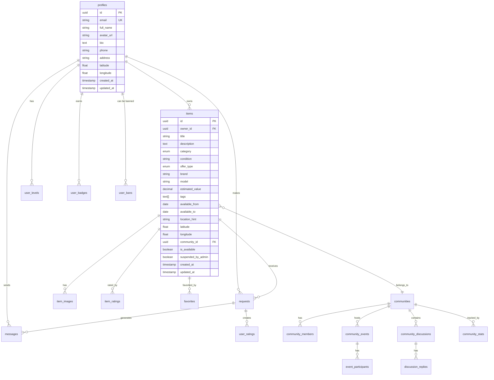

# Schéma de Base de Données - Échangeo

## Vue d'ensemble

La base de données d'Échangeo est construite sur PostgreSQL via Supabase et suit une architecture relationnelle normalisée. Elle gère les utilisateurs, les objets, les échanges, les communautés et les fonctionnalités de gamification.

## Diagramme ERD



## Tables Principales

### 👤 Table `profiles`

Stoque les informations des utilisateurs de la plateforme.

| Colonne | Type | Contraintes | Description |
|---------|------|-------------|-------------|
| `id` | UUID | PK, FK vers auth.users | Identifiant unique de l'utilisateur |
| `email` | VARCHAR(255) | UNIQUE, NOT NULL | Email de l'utilisateur |
| `full_name` | VARCHAR(100) | | Nom complet de l'utilisateur |
| `avatar_url` | TEXT | | URL de l'avatar (stocké dans Supabase Storage) |
| `bio` | TEXT | | Biographie de l'utilisateur |
| `phone` | VARCHAR(20) | | Numéro de téléphone |
| `address` | TEXT | | Adresse complète |
| `latitude` | DECIMAL(10,8) | | Coordonnée GPS latitude |
| `longitude` | DECIMAL(11,8) | | Coordonnée GPS longitude |
| `created_at` | TIMESTAMP | DEFAULT NOW() | Date de création du profil |
| `updated_at` | TIMESTAMP | DEFAULT NOW() | Date de dernière modification |

**Index :**
- `idx_profiles_email` sur `email`
- `idx_profiles_location` sur `(latitude, longitude)` (pour les recherches géographiques)

### 📦 Table `items`

Contient tous les objets mis en partage sur la plateforme.

| Colonne | Type | Contraintes | Description |
|---------|------|-------------|-------------|
| `id` | UUID | PK | Identifiant unique de l'objet |
| `owner_id` | UUID | FK vers profiles(id) | Propriétaire de l'objet |
| `title` | VARCHAR(200) | NOT NULL | Titre de l'objet |
| `description` | TEXT | | Description détaillée |
| `category` | ENUM | NOT NULL | Catégorie de l'objet |
| `condition` | VARCHAR(20) | NOT NULL | État de l'objet |
| `offer_type` | ENUM | DEFAULT 'loan' | Type d'offre (prêt/échange/don) |
| `desired_items` | TEXT | | Objets souhaités en échange |
| `brand` | VARCHAR(100) | | Marque de l'objet |
| `model` | VARCHAR(100) | | Modèle de l'objet |
| `estimated_value` | DECIMAL(10,2) | | Valeur estimée en euros |
| `tags` | TEXT[] | | Tags associés à l'objet |
| `available_from` | DATE | | Date de début de disponibilité |
| `available_to` | DATE | | Date de fin de disponibilité |
| `location_hint` | VARCHAR(200) | | Indice de localisation |
| `latitude` | DECIMAL(10,8) | | Coordonnée GPS latitude |
| `longitude` | DECIMAL(11,8) | | Coordonnée GPS longitude |
| `community_id` | UUID | FK vers communities(id) | Communauté de l'objet |
| `is_available` | BOOLEAN | DEFAULT true | Disponibilité de l'objet |
| `suspended_by_admin` | BOOLEAN | DEFAULT false | Suspension par un admin |
| `created_at` | TIMESTAMP | DEFAULT NOW() | Date de création |
| `updated_at` | TIMESTAMP | DEFAULT NOW() | Date de modification |

**Enums :**
```sql
-- Catégories d'objets
CREATE TYPE item_category AS ENUM (
  'tools', 'electronics', 'books', 'sports', 'kitchen', 
  'garden', 'toys', 'fashion', 'furniture', 'music', 
  'baby', 'art', 'beauty', 'auto', 'office', 'services', 'other'
);

-- Types d'offres
CREATE TYPE offer_type AS ENUM ('loan', 'trade', 'donation');

-- États des objets
CREATE TYPE item_condition AS ENUM ('excellent', 'good', 'fair', 'poor');
```

**Index :**
- `idx_items_owner` sur `owner_id`
- `idx_items_category` sur `category`
- `idx_items_available` sur `is_available`
- `idx_items_location` sur `(latitude, longitude)`
- `idx_items_community` sur `community_id`

### 🖼️ Table `item_images`

Stocke les images associées aux objets.

| Colonne | Type | Contraintes | Description |
|---------|------|-------------|-------------|
| `id` | UUID | PK | Identifiant unique de l'image |
| `item_id` | UUID | FK vers items(id) | Objet associé |
| `url` | TEXT | NOT NULL | URL de l'image dans Supabase Storage |
| `is_primary` | BOOLEAN | DEFAULT false | Image principale |
| `created_at` | TIMESTAMP | DEFAULT NOW() | Date d'upload |

**Index :**
- `idx_item_images_item` sur `item_id`
- `idx_item_images_primary` sur `(item_id, is_primary)`

### 🤝 Table `requests`

Gère les demandes de prêt/échange entre utilisateurs.

| Colonne | Type | Contraintes | Description |
|---------|------|-------------|-------------|
| `id` | UUID | PK | Identifiant unique de la demande |
| `requester_id` | UUID | FK vers profiles(id) | Utilisateur demandeur |
| `item_id` | UUID | FK vers items(id) | Objet demandé |
| `message` | TEXT | | Message du demandeur |
| `status` | VARCHAR(20) | DEFAULT 'pending' | Statut de la demande |
| `requested_from` | DATE | | Date de début souhaitée |
| `requested_to` | DATE | | Date de fin souhaitée |
| `created_at` | TIMESTAMP | DEFAULT NOW() | Date de création |
| `updated_at` | TIMESTAMP | DEFAULT NOW() | Date de modification |

**Statuts possibles :**
- `pending` : En attente de réponse
- `approved` : Approuvée par le propriétaire
- `rejected` : Rejetée par le propriétaire
- `completed` : Échange terminé
- `cancelled` : Annulée par le demandeur

**Index :**
- `idx_requests_requester` sur `requester_id`
- `idx_requests_item` sur `item_id`
- `idx_requests_status` sur `status`

### 💬 Table `messages`

Stocke les messages entre utilisateurs.

| Colonne | Type | Contraintes | Description |
|---------|------|-------------|-------------|
| `id` | UUID | PK | Identifiant unique du message |
| `sender_id` | UUID | FK vers profiles(id) | Expéditeur |
| `receiver_id` | UUID | FK vers profiles(id) | Destinataire |
| `content` | TEXT | NOT NULL | Contenu du message |
| `request_id` | UUID | FK vers requests(id) | Demande associée (optionnel) |
| `created_at` | TIMESTAMP | DEFAULT NOW() | Date d'envoi |

**Index :**
- `idx_messages_sender` sur `sender_id`
- `idx_messages_receiver` sur `receiver_id`
- `idx_messages_request` sur `request_id`
- `idx_messages_conversation` sur `(sender_id, receiver_id, created_at)`

### ❤️ Table `favorites`

Gère les favoris des utilisateurs.

| Colonne | Type | Contraintes | Description |
|---------|------|-------------|-------------|
| `id` | UUID | PK | Identifiant unique |
| `user_id` | UUID | FK vers profiles(id) | Utilisateur |
| `item_id` | UUID | FK vers items(id) | Objet favori |
| `created_at` | TIMESTAMP | DEFAULT NOW() | Date d'ajout |

**Contraintes :**
- UNIQUE sur `(user_id, item_id)` pour éviter les doublons

**Index :**
- `idx_favorites_user` sur `user_id`
- `idx_favorites_item` sur `item_id`

## Tables des Communautés

### 🏘️ Table `communities`

Définit les communautés/quartiers.

| Colonne | Type | Contraintes | Description |
|---------|------|-------------|-------------|
| `id` | UUID | PK | Identifiant unique |
| `name` | VARCHAR(100) | NOT NULL | Nom de la communauté |
| `description` | TEXT | | Description de la communauté |
| `city` | VARCHAR(100) | NOT NULL | Ville |
| `postal_code` | VARCHAR(10) | | Code postal |
| `country` | VARCHAR(50) | DEFAULT 'France' | Pays |
| `center_latitude` | DECIMAL(10,8) | | Latitude du centre |
| `center_longitude` | DECIMAL(11,8) | | Longitude du centre |
| `radius_km` | DECIMAL(5,2) | DEFAULT 2.0 | Rayon en kilomètres |
| `is_active` | BOOLEAN | DEFAULT true | Statut actif |
| `activity_level` | VARCHAR(20) | | Niveau d'activité |
| `created_by` | UUID | FK vers profiles(id) | Créateur |
| `created_at` | TIMESTAMP | DEFAULT NOW() | Date de création |
| `updated_at` | TIMESTAMP | DEFAULT NOW() | Date de modification |

**Index :**
- `idx_communities_location` sur `(center_latitude, center_longitude)`
- `idx_communities_city` sur `city`
- `idx_communities_active` sur `is_active`

### 👥 Table `community_members`

Gère l'appartenance aux communautés.

| Colonne | Type | Contraintes | Description |
|---------|------|-------------|-------------|
| `id` | UUID | PK | Identifiant unique |
| `community_id` | UUID | FK vers communities(id) | Communauté |
| `user_id` | UUID | FK vers profiles(id) | Utilisateur |
| `role` | VARCHAR(20) | DEFAULT 'member' | Rôle dans la communauté |
| `joined_at` | TIMESTAMP | DEFAULT NOW() | Date d'adhésion |
| `is_active` | BOOLEAN | DEFAULT true | Statut actif |

**Rôles :**
- `member` : Membre standard
- `moderator` : Modérateur de la communauté
- `admin` : Administrateur de la communauté

**Contraintes :**
- UNIQUE sur `(community_id, user_id)`

**Index :**
- `idx_community_members_community` sur `community_id`
- `idx_community_members_user` sur `user_id`

### 🎉 Table `community_events`

Événements organisés par les communautés.

| Colonne | Type | Contraintes | Description |
|---------|------|-------------|-------------|
| `id` | UUID | PK | Identifiant unique |
| `community_id` | UUID | FK vers communities(id) | Communauté organisatrice |
| `title` | VARCHAR(200) | NOT NULL | Titre de l'événement |
| `description` | TEXT | | Description détaillée |
| `event_type` | VARCHAR(50) | | Type d'événement |
| `location` | VARCHAR(200) | | Lieu de l'événement |
| `latitude` | DECIMAL(10,8) | | Coordonnée latitude |
| `longitude` | DECIMAL(11,8) | | Coordonnée longitude |
| `start_date` | TIMESTAMP | NOT NULL | Date de début |
| `end_date` | TIMESTAMP | | Date de fin |
| `max_participants` | INTEGER | | Nombre max de participants |
| `created_by` | UUID | FK vers profiles(id) | Créateur |
| `is_active` | BOOLEAN | DEFAULT true | Statut actif |
| `created_at` | TIMESTAMP | DEFAULT NOW() | Date de création |
| `updated_at` | TIMESTAMP | DEFAULT NOW() | Date de modification |

**Types d'événements :**
- `meetup` : Rencontre entre membres
- `swap` : Troc party
- `workshop` : Atelier
- `social` : Événement social
- `other` : Autre

### 👤 Table `event_participants`

Participants aux événements.

| Colonne | Type | Contraintes | Description |
|---------|------|-------------|-------------|
| `id` | UUID | PK | Identifiant unique |
| `event_id` | UUID | FK vers community_events(id) | Événement |
| `user_id` | UUID | FK vers profiles(id) | Participant |
| `status` | VARCHAR(20) | DEFAULT 'registered' | Statut de participation |
| `registered_at` | TIMESTAMP | DEFAULT NOW() | Date d'inscription |

**Statuts :**
- `registered` : Inscrit
- `confirmed` : Confirmé
- `cancelled` : Annulé

### 💭 Table `community_discussions`

Discussions dans les communautés.

| Colonne | Type | Contraintes | Description |
|---------|------|-------------|-------------|
| `id` | UUID | PK | Identifiant unique |
| `community_id` | UUID | FK vers communities(id) | Communauté |
| `title` | VARCHAR(200) | NOT NULL | Titre de la discussion |
| `content` | TEXT | | Contenu initial |
| `author_id` | UUID | FK vers profiles(id) | Auteur |
| `category` | ENUM | NOT NULL | Catégorie de discussion |
| `is_pinned` | BOOLEAN | DEFAULT false | Discussion épinglée |
| `is_locked` | BOOLEAN | DEFAULT false | Discussion verrouillée |
| `created_at` | TIMESTAMP | DEFAULT NOW() | Date de création |
| `updated_at` | TIMESTAMP | DEFAULT NOW() | Date de modification |

**Catégories :**
- `general` : Discussion générale
- `items` : À propos d'objets
- `events` : À propos d'événements
- `help` : Aide et support
- `announcements` : Annonces

### 💬 Table `discussion_replies`

Réponses aux discussions.

| Colonne | Type | Contraintes | Description |
|---------|------|-------------|-------------|
| `id` | UUID | PK | Identifiant unique |
| `discussion_id` | UUID | FK vers community_discussions(id) | Discussion parent |
| `author_id` | UUID | FK vers profiles(id) | Auteur de la réponse |
| `content` | TEXT | NOT NULL | Contenu de la réponse |
| `parent_reply_id` | UUID | FK vers discussion_replies(id) | Réponse parent (optionnel) |
| `created_at` | TIMESTAMP | DEFAULT NOW() | Date de création |
| `updated_at` | TIMESTAMP | DEFAULT NOW() | Date de modification |

### 📊 Table `community_stats`

Statistiques des communautés (calculées périodiquement).

| Colonne | Type | Contraintes | Description |
|---------|------|-------------|-------------|
| `id` | UUID | PK | Identifiant unique |
| `community_id` | UUID | FK vers communities(id) | Communauté |
| `total_members` | INTEGER | DEFAULT 0 | Nombre total de membres |
| `active_members` | INTEGER | DEFAULT 0 | Membres actifs (30 derniers jours) |
| `total_items` | INTEGER | DEFAULT 0 | Nombre total d'objets |
| `total_exchanges` | INTEGER | DEFAULT 0 | Nombre d'échanges |
| `total_events` | INTEGER | DEFAULT 0 | Nombre d'événements |
| `last_activity` | TIMESTAMP | | Dernière activité |
| `calculated_at` | TIMESTAMP | DEFAULT NOW() | Date de calcul |

## Tables de Gamification

### 🏆 Table `user_levels`

Niveaux et points des utilisateurs.

| Colonne | Type | Contraintes | Description |
|---------|------|-------------|-------------|
| `id` | UUID | PK | Identifiant unique |
| `profile_id` | UUID | FK vers profiles(id) | Utilisateur |
| `level` | INTEGER | DEFAULT 1 | Niveau actuel |
| `points` | INTEGER | DEFAULT 0 | Points totaux |
| `title` | VARCHAR(100) | | Titre du niveau |
| `created_at` | TIMESTAMP | DEFAULT NOW() | Date de création |
| `updated_at` | TIMESTAMP | DEFAULT NOW() | Date de modification |

**Contraintes :**
- UNIQUE sur `profile_id`

### 🎯 Table `user_points_history`

Historique des points gagnés.

| Colonne | Type | Contraintes | Description |
|---------|------|-------------|-------------|
| `id` | UUID | PK | Identifiant unique |
| `profile_id` | UUID | FK vers profiles(id) | Utilisateur |
| `points` | INTEGER | NOT NULL | Points gagnés/perdus |
| `reason` | VARCHAR(100) | NOT NULL | Raison |
| `source_type` | VARCHAR(50) | | Type de source |
| `source_id` | UUID | | ID de la source |
| `created_at` | TIMESTAMP | DEFAULT NOW() | Date |

### 🏅 Table `badges`

Badges disponibles.

| Colonne | Type | Contraintes | Description |
|---------|------|-------------|-------------|
| `id` | UUID | PK | Identifiant unique |
| `slug` | VARCHAR(50) | UNIQUE, NOT NULL | Identifiant unique |
| `name` | VARCHAR(100) | NOT NULL | Nom du badge |
| `description` | TEXT | | Description |
| `icon` | VARCHAR(100) | | Nom de l'icône |
| `color` | VARCHAR(20) | | Couleur du badge |
| `rarity` | ENUM | DEFAULT 'common' | Rareté |
| `requirements` | JSONB | | Conditions d'obtention |
| `is_active` | BOOLEAN | DEFAULT true | Badge actif |

**Raretés :**
- `common` : Commun
- `rare` : Rare
- `epic` : Épique
- `legendary` : Légendaire

### 🏆 Table `user_badges`

Badges obtenus par les utilisateurs.

| Colonne | Type | Contraintes | Description |
|---------|------|-------------|-------------|
| `id` | UUID | PK | Identifiant unique |
| `profile_id` | UUID | FK vers profiles(id) | Utilisateur |
| `badge_id` | UUID | FK vers badges(id) | Badge |
| `earned_at` | TIMESTAMP | DEFAULT NOW() | Date d'obtention |
| `source_type` | VARCHAR(50) | | Type de source |
| `source_id` | UUID | | ID de la source |

**Contraintes :**
- UNIQUE sur `(profile_id, badge_id)`

### 🎯 Table `challenges`

Défis disponibles.

| Colonne | Type | Contraintes | Description |
|---------|------|-------------|-------------|
| `id` | UUID | PK | Identifiant unique |
| `title` | VARCHAR(200) | NOT NULL | Titre du défi |
| `description` | TEXT | | Description |
| `type` | ENUM | NOT NULL | Type de défi |
| `target_value` | INTEGER | NOT NULL | Valeur cible |
| `reward_points` | INTEGER | DEFAULT 0 | Points de récompense |
| `reward_badge` | VARCHAR(50) | | Badge de récompense |
| `reward_title` | VARCHAR(100) | | Titre de récompense |
| `is_active` | BOOLEAN | DEFAULT true | Défi actif |

**Types :**
- `daily` : Défi quotidien
- `weekly` : Défi hebdomadaire
- `monthly` : Défi mensuel
- `special` : Défi spécial

### 🎯 Table `user_challenges`

Progression des utilisateurs dans les défis.

| Colonne | Type | Contraintes | Description |
|---------|------|-------------|-------------|
| `id` | UUID | PK | Identifiant unique |
| `profile_id` | UUID | FK vers profiles(id) | Utilisateur |
| `challenge_id` | UUID | FK vers challenges(id) | Défi |
| `progress` | INTEGER | DEFAULT 0 | Progression actuelle |
| `is_completed` | BOOLEAN | DEFAULT false | Défi terminé |
| `completed_at` | TIMESTAMP | | Date de completion |
| `claimed_at` | TIMESTAMP | | Date de réclamation |

**Contraintes :**
- UNIQUE sur `(profile_id, challenge_id)`

## Tables d'Administration

### 🚫 Table `user_bans`

Bannissements d'utilisateurs.

| Colonne | Type | Contraintes | Description |
|---------|------|-------------|-------------|
| `id` | UUID | PK | Identifiant unique |
| `user_id` | UUID | FK vers profiles(id) | Utilisateur banni |
| `reason` | TEXT | NOT NULL | Raison du bannissement |
| `ban_type` | ENUM | NOT NULL | Type de bannissement |
| `expires_at` | TIMESTAMP | | Date d'expiration |
| `banned_by` | UUID | FK vers profiles(id) | Admin qui a banni |
| `is_active` | BOOLEAN | DEFAULT true | Bannissement actif |
| `created_at` | TIMESTAMP | DEFAULT NOW() | Date du bannissement |

**Types :**
- `temporary` : Bannissement temporaire
- `permanent` : Bannissement permanent

### 👤 Table `user_details`

Détails utilisateur pour l'administration.

| Colonne | Type | Contraintes | Description |
|---------|------|-------------|-------------|
| `id` | UUID | PK | Identifiant unique |
| `user_id` | UUID | FK vers profiles(id) | Utilisateur |
| `last_active` | TIMESTAMP | | Dernière connexion |
| `total_items` | INTEGER | DEFAULT 0 | Nombre d'objets créés |
| `total_requests` | INTEGER | DEFAULT 0 | Nombre de demandes |
| `reputation_score` | DECIMAL(3,2) | | Score de réputation |
| `communities_count` | INTEGER | DEFAULT 0 | Nombre de communautés |
| `created_at` | TIMESTAMP | DEFAULT NOW() | Date de création |
| `updated_at` | TIMESTAMP | DEFAULT NOW() | Date de modification |

**Contraintes :**
- UNIQUE sur `user_id`

## Tables d'Évaluation

### ⭐ Table `item_ratings`

Évaluations des objets.

| Colonne | Type | Contraintes | Description |
|---------|------|-------------|-------------|
| `id` | UUID | PK | Identifiant unique |
| `item_id` | UUID | FK vers items(id) | Objet évalué |
| `rater_id` | UUID | FK vers profiles(id) | Évaluateur |
| `score` | INTEGER | NOT NULL | Note (1-5) |
| `comment` | TEXT | | Commentaire |
| `created_at` | TIMESTAMP | DEFAULT NOW() | Date d'évaluation |

**Contraintes :**
- UNIQUE sur `(item_id, rater_id)`
- CHECK sur `score` (1 <= score <= 5)

### 👥 Table `user_ratings`

Évaluations des utilisateurs.

| Colonne | Type | Contraintes | Description |
|---------|------|-------------|-------------|
| `id` | UUID | PK | Identifiant unique |
| `request_id` | UUID | FK vers requests(id) | Demande associée |
| `rater_id` | UUID | FK vers profiles(id) | Évaluateur |
| `rated_user_id` | UUID | FK vers profiles(id) | Utilisateur évalué |
| `communication_score` | INTEGER | NOT NULL | Note communication (1-5) |
| `punctuality_score` | INTEGER | NOT NULL | Note ponctualité (1-5) |
| `care_score` | INTEGER | NOT NULL | Note soin (1-5) |
| `comment` | TEXT | | Commentaire |
| `created_at` | TIMESTAMP | DEFAULT NOW() | Date d'évaluation |

**Contraintes :**
- UNIQUE sur `(request_id, rater_id)`
- CHECK sur les scores (1 <= score <= 5)

## Tables de Notifications

### 🔔 Table `notifications`

Notifications utilisateur.

| Colonne | Type | Contraintes | Description |
|---------|------|-------------|-------------|
| `id` | UUID | PK | Identifiant unique |
| `profile_id` | UUID | FK vers profiles(id) | Destinataire |
| `type` | VARCHAR(50) | NOT NULL | Type de notification |
| `title` | VARCHAR(200) | NOT NULL | Titre |
| `message` | TEXT | NOT NULL | Message |
| `data` | JSONB | | Données supplémentaires |
| `read` | BOOLEAN | DEFAULT false | Lu |
| `created_at` | TIMESTAMP | DEFAULT NOW() | Date de création |
| `expires_at` | TIMESTAMP | | Date d'expiration |

**Types de notifications :**
- `new_request` : Nouvelle demande
- `request_approved` : Demande approuvée
- `new_message` : Nouveau message
- `badge_earned` : Badge obtenu
- `level_up` : Montée de niveau
- `event_reminder` : Rappel d'événement

## Vues et Fonctions

### Vues Principales

#### `profile_reputation_stats`
Vue agrégée des statistiques de réputation des utilisateurs.

```sql
CREATE VIEW profile_reputation_stats AS
SELECT 
  p.id as profile_id,
  COUNT(ur.id) as ratings_count,
  COALESCE(AVG(ur.communication_score), 0) as avg_communication,
  COALESCE(AVG(ur.punctuality_score), 0) as avg_punctuality,
  COALESCE(AVG(ur.care_score), 0) as avg_care,
  COALESCE(
    (AVG(ur.communication_score) + AVG(ur.punctuality_score) + AVG(ur.care_score)) / 3,
    0
  ) as overall_score
FROM profiles p
LEFT JOIN user_ratings ur ON p.id = ur.rated_user_id
GROUP BY p.id;
```

#### `item_rating_stats`
Vue agrégée des statistiques d'évaluation des objets.

```sql
CREATE VIEW item_rating_stats AS
SELECT 
  i.id as item_id,
  COUNT(ir.id) as ratings_count,
  COALESCE(AVG(ir.score), 0) as average_rating
FROM items i
LEFT JOIN item_ratings ir ON i.id = ir.item_id
GROUP BY i.id;
```

#### `community_overview`
Vue d'aperçu des communautés avec statistiques.

```sql
CREATE VIEW community_overview AS
SELECT 
  c.*,
  cs.total_members,
  cs.active_members,
  cs.total_items,
  cs.total_exchanges,
  cs.last_activity,
  CASE 
    WHEN cs.active_members > 50 THEN 'active'
    WHEN cs.active_members > 20 THEN 'moderate'
    ELSE 'inactive'
  END as activity_level
FROM communities c
LEFT JOIN community_stats cs ON c.id = cs.community_id;
```

### Fonctions Utilitaires

#### `calculate_distance_km`
Calcule la distance entre deux points géographiques.

```sql
CREATE OR REPLACE FUNCTION calculate_distance_km(
  lat1 DECIMAL(10,8),
  lon1 DECIMAL(11,8),
  lat2 DECIMAL(10,8),
  lon2 DECIMAL(11,8)
) RETURNS DECIMAL(10,2) AS $$
BEGIN
  RETURN (
    6371 * acos(
      cos(radians(lat1)) * 
      cos(radians(lat2)) * 
      cos(radians(lon2) - radians(lon1)) + 
      sin(radians(lat1)) * 
      sin(radians(lat2))
    )
  );
END;
$$ LANGUAGE plpgsql;
```

#### `find_nearby_communities`
Trouve les communautés à proximité d'un point.

```sql
CREATE OR REPLACE FUNCTION find_nearby_communities(
  center_lat DECIMAL(10,8),
  center_lon DECIMAL(11,8),
  radius_km DECIMAL(5,2) DEFAULT 10
) RETURNS TABLE (
  community_id UUID,
  community_name VARCHAR,
  distance_km DECIMAL(10,2),
  member_count BIGINT
) AS $$
BEGIN
  RETURN QUERY
  SELECT 
    c.id,
    c.name,
    calculate_distance_km(center_lat, center_lon, c.center_latitude, c.center_longitude) as distance,
    COUNT(cm.id)::BIGINT as members
  FROM communities c
  LEFT JOIN community_members cm ON c.id = cm.community_id AND cm.is_active = true
  WHERE 
    calculate_distance_km(center_lat, center_lon, c.center_latitude, c.center_longitude) <= radius_km
    AND c.is_active = true
  GROUP BY c.id, c.name, c.center_latitude, c.center_longitude
  ORDER BY distance;
END;
$$ LANGUAGE plpgsql;
```

## Politiques de Sécurité (RLS)

### Profils
```sql
-- Les utilisateurs peuvent voir tous les profils
CREATE POLICY "Profiles are viewable by everyone" ON profiles
FOR SELECT USING (true);

-- Les utilisateurs peuvent seulement modifier leur propre profil
CREATE POLICY "Users can update own profile" ON profiles
FOR UPDATE USING (auth.uid() = id);
```

### Objets
```sql
-- Les objets disponibles sont visibles par tous
CREATE POLICY "Available items are viewable by everyone" ON items
FOR SELECT USING (
  is_available = true AND 
  suspended_by_admin = false
);

-- Les utilisateurs peuvent créer des objets
CREATE POLICY "Users can create items" ON items
FOR INSERT WITH CHECK (auth.uid() = owner_id);

-- Les propriétaires peuvent modifier leurs objets
CREATE POLICY "Users can update own items" ON items
FOR UPDATE USING (auth.uid() = owner_id);
```

### Messages
```sql
-- Les utilisateurs peuvent voir leurs conversations
CREATE POLICY "Users can view own conversations" ON messages
FOR SELECT USING (
  auth.uid() = sender_id OR 
  auth.uid() = receiver_id
);

-- Les utilisateurs peuvent envoyer des messages
CREATE POLICY "Users can send messages" ON messages
FOR INSERT WITH CHECK (auth.uid() = sender_id);
```

Cette architecture de base de données permet à Échangeo de gérer efficacement tous les aspects de la plateforme : utilisateurs, objets, échanges, communautés, gamification et administration, tout en maintenant la sécurité et les performances.
