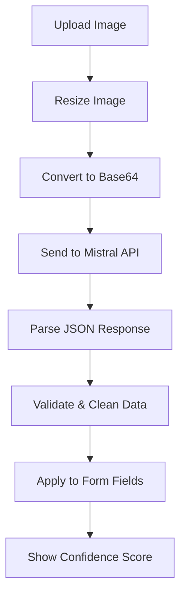

# Implémentation de l'Analyse IA - TrocAll 🤖

## Vue d'ensemble

Le système d'analyse IA utilise l'API Mistral pour analyser automatiquement les images d'objets et pré-remplir les informations lors de la création d'annonces. Cette fonctionnalité améliore significativement l'expérience utilisateur en réduisant le temps de saisie et en garantissant des descriptions plus précises.

## 🚀 Fonctionnalités Implémentées

### 1. **Reconnaissance d'Objets Automatique**
- **Titre intelligent** : Génération automatique de titres descriptifs
- **Catégorisation** : Classification automatique dans les 9 catégories TrocAll
- **Détection d'état** : Évaluation visuelle de la condition (excellent, bon, correct, usé)
- **Extraction de marque/modèle** : Reconnaissance des marques et modèles visibles
- **Estimation de valeur** : Estimation du prix basée sur l'analyse visuelle
- **Tags intelligents** : Génération de mots-clés pertinents en français

### 2. **Interface Utilisateur Optimisée**
- **Upload en première étape** : Les photos sont maintenant la première étape du processus
- **Analyse automatique** : L'IA s'active dès l'upload de la première image
- **Feedback visuel** : Indicateurs de confiance et suggestions d'amélioration
- **Champs pré-remplis** : Mise en évidence des champs complétés par l'IA
- **Validation intelligente** : Suggestions contextuelles pour améliorer l'annonce

## 🏗️ Architecture Technique

### Services
- **`aiService.ts`** : Service principal pour l'intégration Mistral IA
- **`useAIAnalysis.ts`** : Hook React pour gérer l'état de l'analyse
- **`AIAnalysisCard.tsx`** : Composant d'affichage des résultats IA
- **`AIImageUpload.tsx`** : Composant d'upload avec analyse automatique

### Flux de Données


## 🔧 Configuration

### Variables d'Environnement
```env
VITE_MISTRAL_API_KEY=your_mistral_api_key
```

### Obtenir une Clé API Mistral
1. Créer un compte sur [mistral.ai](https://mistral.ai)
2. Aller dans les paramètres API
3. Générer une nouvelle clé API
4. L'ajouter dans `.env.local`

## 📋 Utilisation

### Pour les Utilisateurs
1. **Étape 1 - Photos & IA** : Upload d'images avec analyse automatique
2. **Étape 2 - Informations** : Vérification/modification des champs pré-remplis
3. **Étape 3 - Détails** : Ajout d'informations complémentaires
4. **Étape 4 - Disponibilité** : Configuration des dates et localisation

### Indicateurs Visuels
- **Badge IA** sur les images analysées
- **Champs colorés** (violet) pour les données pré-remplies
- **Score de confiance** avec code couleur :
  - 🟢 Vert (80%+) : Très fiable
  - 🟡 Ambre (60-79%) : Fiable
  - 🔴 Rouge (<60%) : À vérifier

## 🎯 Prompts IA Optimisés

### Prompt Principal
Le système utilise un prompt structuré qui demande à Mistral de :
- Analyser l'image avec précision
- Retourner un JSON strictement formaté
- Respecter les catégories TrocAll
- Estimer les valeurs pour le marché français
- Générer des tags pertinents en français

### Validation des Réponses
- **Nettoyage automatique** des réponses IA
- **Validation des catégories** contre l'enum TrocAll
- **Limitation des caractères** pour éviter les débordements
- **Fallbacks** en cas de données invalides

## 🔒 Sécurité & Performance

### Optimisations
- **Redimensionnement d'images** avant envoi (800x600 max)
- **Compression** avec qualité ajustable (80% par défaut)
- **Limitation de taille** (5Mo max par image)
- **Gestion d'erreurs** robuste avec retry

### Sécurité
- **Validation côté client** des formats d'images
- **Sanitisation** des réponses IA
- **Gestion des erreurs** API avec messages utilisateur
- **Clé API** stockée en variable d'environnement

## 📊 Métriques & Monitoring

### Indicateurs de Performance
- **Temps de réponse** API Mistral
- **Taux de succès** des analyses
- **Score de confiance** moyen
- **Taux d'adoption** de l'IA par les utilisateurs

### Logs & Debugging
- **Console logs** pour les erreurs d'analyse
- **Validation** des réponses JSON
- **Fallbacks** en cas d'échec API

## 🚀 Améliorations Futures

### Court Terme
- **Cache des analyses** pour éviter les re-analyses
- **Support multi-langues** pour les prompts
- **Analyse batch** de plusieurs images
- **Suggestions contextuelles** améliorées

### Moyen Terme
- **Fine-tuning** du modèle sur les objets TrocAll
- **Analyse de sentiment** des descriptions
- **Détection de défauts** automatique
- **Recommandations de prix** basées sur l'historique

### Long Terme
- **Modèle IA local** pour réduire les coûts
- **Reconnaissance vocale** pour descriptions
- **Réalité augmentée** pour validation
- **IA collaborative** avec feedback utilisateur

## 💡 Conseils d'Utilisation

### Pour de Meilleurs Résultats
1. **Photos nettes** avec bon éclairage
2. **Objet centré** dans le cadre
3. **Arrière-plan neutre** si possible
4. **Marques/étiquettes visibles**
5. **Angles multiples** pour objets complexes

### Gestion des Erreurs
- **Retry automatique** en cas d'échec réseau
- **Messages d'erreur** explicites pour l'utilisateur
- **Fallback manuel** si l'IA échoue
- **Support hors ligne** (désactivation gracieuse)

---

Cette implémentation positionne TrocAll comme une plateforme innovante utilisant l'IA pour simplifier l'expérience utilisateur, tout en maintenant la flexibilité et le contrôle manuel. 🎯
