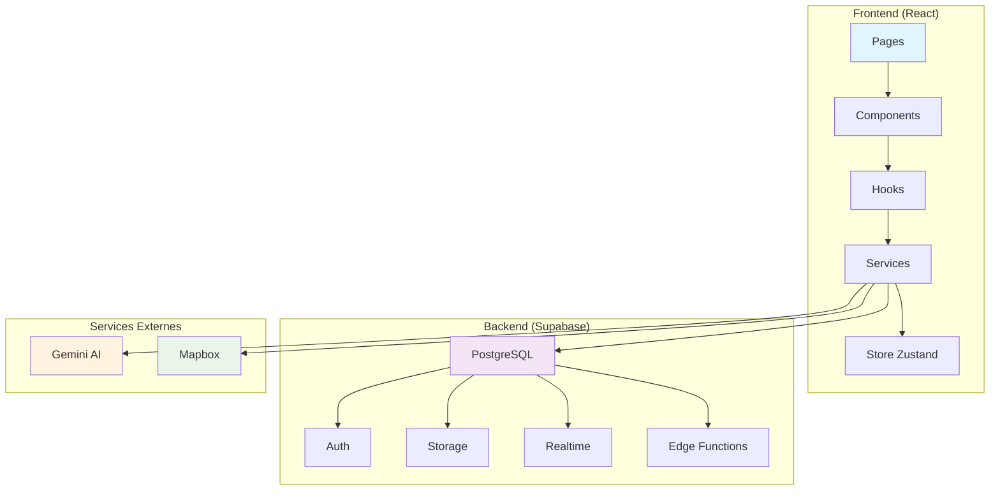

# Architecture Technique - Échangeo

## Vue d'ensemble

Échangeo est une application web moderne construite avec une architecture full-stack utilisant React et Supabase. L'application suit les principes de l'architecture hexagonale avec une séparation claire entre les couches de présentation, logique métier et données.

## Architecture Générale



## Stack Technique Détaillée

### Frontend Architecture

#### 1. **React 18 avec TypeScript**
- **Composants fonctionnels** avec hooks
- **TypeScript strict** pour la sécurité des types
- **Concurrent Features** (Suspense, Concurrent Mode)
- **Error Boundaries** pour la gestion d'erreurs

#### 2. **Architecture des Composants**

```
src/components/
├── ui/                    # Composants de base réutilisables
│   ├── Button.tsx         # Bouton avec variants
│   ├── Card.tsx          # Carte générique
│   ├── Input.tsx          # Champ de saisie
│   ├── Modal.tsx         # Modale générique
│   └── ...
├── admin/                 # Composants d'administration
│   ├── AdminGuard.tsx    # Protection des routes admin
│   ├── AdminTable.tsx    # Tableau avec actions
│   ├── StatCard.tsx      # Cartes de statistiques
│   └── ...
├── modals/                # Modales spécialisées
│   └── NeighborhoodSelectionModal.tsx
├── Shell.tsx             # Layout principal
├── Topbar.tsx            # Navigation desktop
├── BottomNavigation.tsx   # Navigation mobile
└── ...
```

#### 3. **Gestion d'État**

**Zustand** pour l'état global :
```typescript
// authStore.ts
interface AuthState {
  user: User | null;
  profile: Profile | null;
  loading: boolean;
  signUp: (email: string, password: string) => Promise<void>;
  signIn: (email: string, password: string) => Promise<void>;
  signOut: () => Promise<void>;
}
```

**TanStack Query** pour l'état serveur :
```typescript
// useItems.ts
export function useItems(filters?: ItemFilters) {
  return useQuery({
    queryKey: ['items', filters],
    queryFn: async () => {
      // Logique de récupération des données
    },
    staleTime: 1000 * 60 * 5, // 5 minutes
  });
}
```

#### 4. **Routing et Navigation**

```typescript
// App.tsx
<Routes>
  {/* Routes publiques */}
  <Route path="/" element={<LandingPage />} />
  <Route path="/login" element={<LoginPage />} />
  
  {/* Routes protégées */}
  <Route path="/*" element={
    <Shell>
      <Routes>
        <Route path="/" element={<HomePage />} />
        <Route path="/items" element={<ItemsPage />} />
        <Route path="/communities" element={<CommunitiesPage />} />
        {/* ... */}
      </Routes>
    </Shell>
  } />
  
  {/* Routes admin */}
  <Route path="/admin/*" element={
    <AdminGuard>
      <AdminRoutes />
    </AdminGuard>
  } />
</Routes>
```

### Backend Architecture (Supabase)

#### 1. **Base de Données PostgreSQL**

**Tables principales** :
- `profiles` - Profils utilisateurs
- `items` - Objets à partager
- `requests` - Demandes d'emprunt/échange
- `messages` - Messages entre utilisateurs
- `communities` - Communautés de quartier
- `user_levels` - Système de gamification
- `badges` - Badges de réputation

**Relations** :
```sql
-- Exemple de relation avec RLS
CREATE POLICY "Users can view their own profile" ON profiles
  FOR SELECT USING (auth.uid() = id);

CREATE POLICY "Users can update their own profile" ON profiles
  FOR UPDATE USING (auth.uid() = id);
```

#### 2. **Authentification**

**Supabase Auth** avec :
- Inscription/Connexion par email
- Gestion des sessions
- Vérification des utilisateurs bannis
- Row Level Security (RLS)

```typescript
// Vérification des bannissements
const { data: banStatus } = await supabase.rpc('is_user_banned', {
  target_user_id: user.id
});
```

#### 3. **Storage**

**Supabase Storage** pour :
- Images d'objets (`items` bucket)
- Avatars utilisateurs (`avatars` bucket)
- Optimisation automatique des images

#### 4. **Realtime**

**Supabase Realtime** pour :
- Notifications en temps réel
- Mise à jour des messages
- Statuts des demandes

### Services Externes

#### 1. **Gemini AI**

**Fonctionnalités** :
- Analyse d'images pour catégorisation
- Suggestions de descriptions
- Assistant de chat contextuel

```typescript
// aiService.ts
export const analyzeImageWithAI = async (file: File): Promise<AIAnalysisResult> => {
  const response = await fetch(`${GEMINI_API_URL}?key=${apiKey}`, {
    method: 'POST',
    body: JSON.stringify({
      contents: [{
        parts: [
          { text: prompt },
          { inline_data: { mime_type: file.type, data: base64Image } }
        ]
      }]
    })
  });
};
```

#### 2. **Mapbox**

**Fonctionnalités** :
- Cartes interactives
- Géolocalisation des objets
- Calcul de distances
- Visualisation des communautés

## Patterns Architecturaux

### 1. **Custom Hooks Pattern**

```typescript
// useItems.ts
export function useItems(filters?: ItemFilters) {
  return useQuery({
    queryKey: ['items', filters],
    queryFn: () => fetchItems(filters),
    staleTime: 1000 * 60 * 5,
  });
}

export function useCreateItem() {
  const queryClient = useQueryClient();
  
  return useMutation({
    mutationFn: createItem,
    onSuccess: () => {
      queryClient.invalidateQueries({ queryKey: ['items'] });
    },
  });
}
```

### 2. **Service Layer Pattern**

```typescript
// services/supabase.ts
export const supabase = createClient<Database>(supabaseUrl, supabaseAnonKey);

// services/aiService.ts
export const analyzeImageWithAI = async (file: File) => {
  // Logique d'analyse IA
};
```

### 3. **Component Composition Pattern**

```typescript
// Shell.tsx
const Shell: React.FC<ShellProps> = ({ children }) => {
  return (
    <div className="min-h-screen bg-gray-50 flex flex-col">
      <Topbar />
      <main className="flex-1">
        <AnimatePresence mode="wait">
          <motion.div key={location.pathname}>
            {children}
          </motion.div>
        </AnimatePresence>
      </main>
      <BottomNavigation />
    </div>
  );
};
```

## Sécurité

### 1. **Row Level Security (RLS)**

```sql
-- Exemple : Les utilisateurs ne peuvent voir que leurs propres objets
CREATE POLICY "Users can view their own items" ON items
  FOR SELECT USING (auth.uid() = owner_id);

-- Exemple : Les utilisateurs peuvent voir les objets publics
CREATE POLICY "Public items are viewable by everyone" ON items
  FOR SELECT USING (is_available = true AND suspended_by_admin = false);
```

### 2. **Validation des Données**

```typescript
// validation.ts
export const itemSchema = z.object({
  title: z.string().min(1).max(80),
  description: z.string().max(300).optional(),
  category: z.enum(['tools', 'electronics', 'books', ...]),
  condition: z.enum(['excellent', 'good', 'fair', 'poor']),
});
```

### 3. **Sanitisation**

```typescript
// Upload d'images sécurisé
const sanitizedOriginal = file.name
  .normalize('NFKD')
  .replace(/[^\w.\-\s]/g, '')
  .replace(/\s+/g, '-')
  .toLowerCase();
```

## Performance

### 1. **Optimisations Frontend**

- **Lazy Loading** des composants
- **Memoization** avec React.memo
- **Code Splitting** avec Vite
- **Image Optimization** avec Supabase Storage

### 2. **Optimisations Backend**

- **Indexes** sur les colonnes fréquemment utilisées
- **Views** pour les requêtes complexes
- **Pagination** pour les grandes listes
- **Caching** avec TanStack Query

### 3. **Optimisations Base de Données**

```sql
-- Index pour les recherches géographiques
CREATE INDEX idx_communities_location ON communities (center_latitude, center_longitude);

-- Index pour les recherches de texte
CREATE INDEX idx_items_title_search ON items USING gin(to_tsvector('french', title));
```

## Monitoring et Observabilité

### 1. **Logging**

```typescript
// Logging des erreurs
console.error('Erreur lors de l\'analyse IA:', error);
```

### 2. **Métriques**

- Temps de réponse des APIs
- Taux d'erreur
- Utilisation des fonctionnalités
- Performance des requêtes

### 3. **Alertes**

- Erreurs critiques
- Performance dégradée
- Utilisateurs bannis

## Déploiement

### 1. **Frontend (Netlify)**

```toml
# netlify.toml
[build]
  command = "npm run build"
  publish = "dist"

[[redirects]]
  from = "/*"
  to = "/index.html"
  status = 200
```

### 2. **Base de Données (Supabase)**

- Migrations automatiques
- Backups automatiques
- Scaling automatique

### 3. **Variables d'Environnement**

```env
# Production
VITE_SUPABASE_URL=https://your-project.supabase.co
VITE_SUPABASE_ANON_KEY=your-anon-key
VITE_GEMINI_API_KEY=your-gemini-key
VITE_MAPBOX_TOKEN=your-mapbox-token
```

## Évolutivité

### 1. **Scaling Horizontal**

- **CDN** pour les assets statiques
- **Load Balancing** pour les APIs
- **Database Sharding** si nécessaire

### 2. **Scaling Vertical**

- **Upgrade** des instances Supabase
- **Optimisation** des requêtes
- **Caching** avancé

### 3. **Microservices**

- **Edge Functions** pour la logique métier
- **Services externes** pour l'IA
- **APIs tierces** pour les cartes

## Conclusion

L'architecture de Échangeo est conçue pour être :
- **Modulaire** : Composants réutilisables
- **Scalable** : Architecture cloud-native
- **Maintenable** : Code TypeScript strict
- **Sécurisée** : RLS et validation
- **Performante** : Optimisations multiples

Cette architecture permet une évolution progressive et une maintenance facilitée tout en offrant une expérience utilisateur optimale.