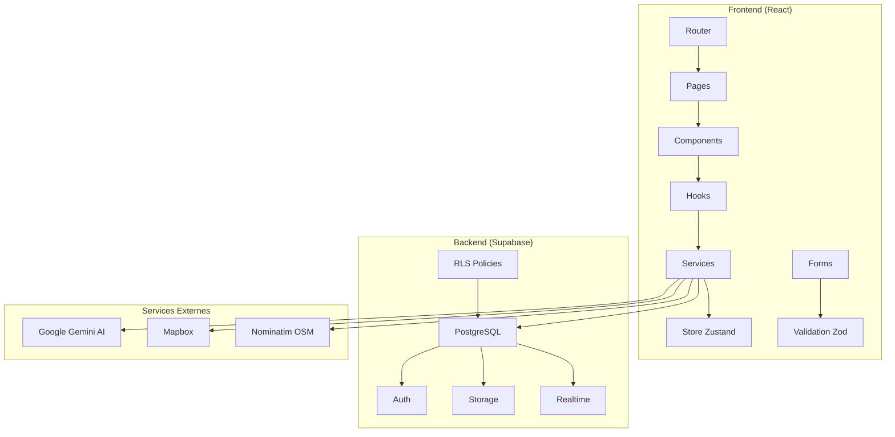

# Architecture Technique - Échangeo

## 🏗️ Vue d'ensemble

Échangeo suit une architecture moderne **SPA (Single Page Application)** avec une séparation claire entre le frontend React et le backend Supabase. L'application utilise des patterns éprouvés pour assurer la scalabilité et la maintenabilité.

## 📊 Schéma Architectural



## 🎯 Patterns Architecturaux

### 1. **Clean Architecture**
```
src/
├── pages/          # Couche Présentation
├── components/     # Couche UI
├── hooks/          # Couche Logique Métier
├── services/       # Couche Infrastructure
├── types/          # Couche Domain
└── utils/          # Couche Utilitaires
```

### 2. **Separation of Concerns**
- **Pages** : Routage et orchestration
- **Components** : Interface utilisateur pure
- **Hooks** : Logique métier et état
- **Services** : Communication externe
- **Types** : Contrats et interfaces

### 3. **Dependency Injection**
- Services injectés via hooks personnalisés
- Configuration via variables d'environnement
- Mocking facilité pour les tests

## 🔧 Stack Technique Détaillée

### Frontend Core
```typescript
// React 18 avec Concurrent Features
- Suspense pour le lazy loading
- Error Boundaries pour la gestion d'erreurs
- Strict Mode pour la détection de bugs

// TypeScript strict
- Types stricts pour toutes les interfaces
- Validation runtime avec Zod
- IntelliSense complet
```

### State Management
```typescript
// TanStack Query (Serveur State)
- Cache intelligent des données API
- Synchronisation automatique
- Optimistic updates
- Retry et error handling

// Zustand (Client State)
- État global minimaliste
- Persistence locale
- DevTools intégrées
- TypeScript first
```

### Styling & UI
```typescript
// Tailwind CSS
- Utility-first CSS
- Design system cohérent
- Responsive design
- Dark mode ready

// Framer Motion
- Animations fluides
- Gestures et transitions
- Performance optimisée
- Accessibility friendly
```

## 🗄️ Architecture Base de Données

### Modèle Relationnel
```sql
-- Entités principales
profiles (users)
├── items (objets)
│   ├── item_images (photos)
│   ├── item_ratings (évaluations)
│   └── requests (demandes)
├── messages (conversations)
├── communities (quartiers)
│   ├── community_members
│   ├── community_events
│   └── community_discussions
└── user_levels (gamification)
```

### Sécurité (RLS)
```sql
-- Row Level Security activée
- Politiques par utilisateur
- Isolation des données
- Audit trail automatique
- Conformité RGPD
```

### Performance
```sql
-- Index optimisés
- Géolocalisation (lat/lng)
- Recherche textuelle (GIN)
- Relations fréquentes (FK)
- Agrégations (views matérialisées)
```

## 🔄 Flux de Données

### 1. **Authentification**
```typescript
User Login → Supabase Auth → JWT Token → 
AuthStore (Zustand) → Protected Routes
```

### 2. **Gestion des Objets**
```typescript
Create Item → Form Validation (Zod) → 
Supabase Insert → Cache Update (TanStack) → 
UI Refresh
```

### 3. **Recherche et Filtres**
```typescript
User Input → Debounced Search → 
Supabase Query → Cache Check → 
Results Display
```

### 4. **Notifications Temps Réel**
```typescript
Database Change → Supabase Realtime → 
WebSocket → Client Update → 
UI Notification
```

## 🤖 Intégration IA

### Architecture IA
```typescript
// Google Gemini Integration
Image Upload → Base64 Encoding → 
Gemini Vision API → Analysis Result → 
Form Pre-filling → User Review
```

### Services IA
- **Image Analysis** : Catégorisation automatique
- **Chat Assistant** : Suggestions contextuelles
- **Conflict Mediation** : Résolution automatique
- **Neighborhood Suggestion** : Géolocalisation intelligente

## 🗺️ Géolocalisation

### Stack Géospatial
```typescript
// Mapbox Integration
User Location → Mapbox GL JS → 
Interactive Maps → Marker Clustering → 
Distance Calculations
```

### Services Géographiques
- **Nominatim** : Géocodification inverse
- **Supabase PostGIS** : Requêtes spatiales
- **Mapbox** : Rendu cartographique
- **Browser Geolocation** : Position utilisateur

## 🔒 Sécurité

### Frontend Security
```typescript
// Validation côté client
- Zod schemas stricts
- XSS protection (React)
- CSRF tokens (Supabase)
- Input sanitization
```

### Backend Security
```sql
-- Supabase Security
- Row Level Security (RLS)
- JWT authentication
- API rate limiting
- Audit logging
```

### Data Protection
- **Chiffrement** : TLS 1.3 en transit
- **Stockage** : Chiffrement au repos
- **RGPD** : Consentement et suppression
- **Anonymisation** : Données sensibles

## 📱 Responsive Design

### Breakpoints
```css
/* Mobile First */
sm: 640px   /* Mobile large */
md: 768px   /* Tablet */
lg: 1024px  /* Desktop */
xl: 1280px  /* Large desktop */
```

### Adaptabilité
- **Touch-friendly** : Gestures mobiles
- **Progressive Enhancement** : Fonctionnalités dégradées
- **Offline Support** : Cache intelligent
- **Performance** : Lazy loading et code splitting

## 🧪 Architecture de Tests

### Stratégie de Tests
```typescript
// Tests Unitaires (Vitest)
- Utilitaires et helpers
- Hooks personnalisés
- Composants isolés
- Services mockés

// Tests d'Intégration
- Flux utilisateur complets
- API integration
- State management
- Routing

// Tests E2E (Playwright)
- Scénarios critiques
- Cross-browser
- Performance
- Accessibility
```

### Mocking Strategy
```typescript
// Services externes mockés
- Supabase client
- Gemini AI API
- Mapbox services
- Browser APIs
```

## 🚀 Performance

### Optimisations Frontend
```typescript
// Code Splitting
- Route-based splitting
- Component lazy loading
- Bundle analysis
- Tree shaking

// Caching Strategy
- TanStack Query cache
- Service Worker
- Browser cache
- CDN assets
```

### Optimisations Backend
```sql
-- Database Performance
- Index stratégiques
- Query optimization
- Connection pooling
- Read replicas
```

## 🔄 CI/CD Pipeline

### Développement
```yaml
# GitHub Actions
- Lint & Type Check
- Unit Tests
- Build Verification
- Security Scan
```

### Déploiement
```yaml
# Production Pipeline
- Build Optimization
- Asset Compression
- Environment Setup
- Health Checks
```

## 📊 Monitoring

### Métriques Frontend
- **Core Web Vitals** : LCP, FID, CLS
- **Error Tracking** : Sentry integration
- **User Analytics** : Privacy-first
- **Performance** : Real User Monitoring

### Métriques Backend
- **Database Performance** : Query times
- **API Response Times** : Supabase metrics
- **Error Rates** : Exception tracking
- **Usage Patterns** : Business metrics

## 🔮 Évolutivité

### Scalabilité Horizontale
- **Stateless Frontend** : CDN deployment
- **Database Sharding** : Supabase scaling
- **Microservices Ready** : Service separation
- **Container Ready** : Docker support

### Scalabilité Verticale
- **Component Optimization** : React.memo
- **Bundle Optimization** : Webpack/Vite
- **Database Optimization** : Query tuning
- **Caching Layers** : Multi-level caching

---

Cette architecture garantit une application robuste, performante et évolutive, prête pour la croissance et les nouvelles fonctionnalités.