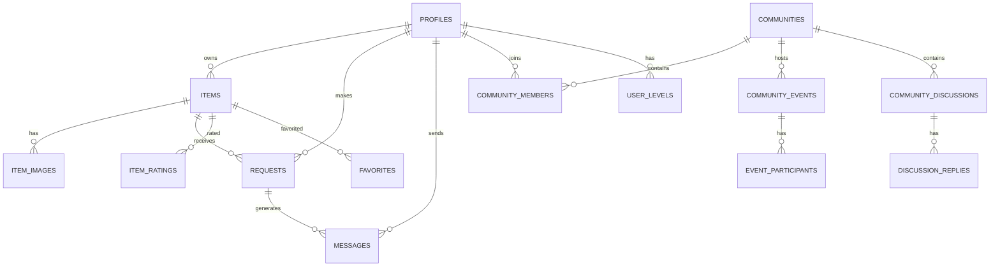

# Schéma de Base de Données - Échangeo

## 🗄️ Vue d'ensemble

Échangeo utilise **PostgreSQL** via Supabase avec un schéma relationnel optimisé pour les échanges locaux. Le design privilégie la performance, la sécurité (RLS) et l'évolutivité.

## 📊 Diagramme Entité-Relation



## 👤 Table `profiles`

**Description** : Profils utilisateurs étendus (au-delà de l'auth Supabase)

```sql
CREATE TABLE profiles (
  id uuid REFERENCES auth.users(id) ON DELETE CASCADE PRIMARY KEY,
  email text UNIQUE NOT NULL,
  full_name text,
  avatar_url text,
  bio text,
  phone text,
  address text,
  latitude double precision,
  longitude double precision,
  is_suspended boolean DEFAULT false,
  suspension_reason text,
  created_at timestamptz DEFAULT now(),
  updated_at timestamptz DEFAULT now()
);
```

**Index** :
- `idx_profiles_location` sur `(latitude, longitude)`
- `idx_profiles_email` sur `email`
- `idx_profiles_created_at` sur `created_at`

## 📦 Table `items`

**Description** : Objets disponibles pour échange/prêt/don

```sql
CREATE TABLE items (
  id uuid PRIMARY KEY DEFAULT uuid_generate_v4(),
  owner_id uuid REFERENCES profiles(id) ON DELETE CASCADE NOT NULL,
  title text NOT NULL,
  description text,
  category text NOT NULL CHECK (category IN (
    'tools', 'electronics', 'books', 'sports', 'kitchen', 
    'garden', 'toys', 'fashion', 'furniture', 'music', 
    'baby', 'art', 'beauty', 'auto', 'office', 'services', 'other'
  )),
  condition text NOT NULL CHECK (condition IN ('excellent', 'good', 'fair', 'poor')),
  offer_type text DEFAULT 'loan' CHECK (offer_type IN ('loan', 'trade', 'donation')),
  desired_items text, -- Pour les trocs
  brand text,
  model text,
  estimated_value numeric(10,2),
  tags text[] DEFAULT '{}',
  available_from date,
  available_to date,
  location_hint text,
  latitude double precision,
  longitude double precision,
  is_available boolean DEFAULT true,
  suspended_by_admin boolean DEFAULT false,
  suspension_reason text,
  created_at timestamptz DEFAULT now(),
  updated_at timestamptz DEFAULT now()
);
```

**Index** :
- `idx_items_location` sur `(latitude, longitude)`
- `idx_items_category` sur `category`
- `idx_items_owner` sur `owner_id`
- `idx_items_available` sur `is_available`
- `idx_items_offer_type` sur `offer_type`
- `idx_items_created_at` sur `created_at`

## 🖼️ Table `item_images`

**Description** : Images associées aux objets

```sql
CREATE TABLE item_images (
  id uuid PRIMARY KEY DEFAULT uuid_generate_v4(),
  item_id uuid REFERENCES items(id) ON DELETE CASCADE NOT NULL,
  url text NOT NULL,
  is_primary boolean DEFAULT false,
  created_at timestamptz DEFAULT now()
);
```

## 📝 Table `requests`

**Description** : Demandes d'emprunt/échange

```sql
CREATE TABLE requests (
  id uuid PRIMARY KEY DEFAULT uuid_generate_v4(),
  requester_id uuid REFERENCES profiles(id) ON DELETE CASCADE NOT NULL,
  item_id uuid REFERENCES items(id) ON DELETE CASCADE NOT NULL,
  message text,
  status text DEFAULT 'pending' CHECK (status IN ('pending', 'approved', 'rejected', 'completed')),
  requested_from timestamptz,
  requested_to timestamptz,
  created_at timestamptz DEFAULT now(),
  updated_at timestamptz DEFAULT now()
);
```

## 💬 Table `messages`

**Description** : Messages entre utilisateurs

```sql
CREATE TABLE messages (
  id uuid PRIMARY KEY DEFAULT uuid_generate_v4(),
  sender_id uuid REFERENCES profiles(id) ON DELETE CASCADE NOT NULL,
  receiver_id uuid REFERENCES profiles(id) ON DELETE CASCADE NOT NULL,
  content text NOT NULL,
  conversation_id uuid NOT NULL,
  is_read boolean DEFAULT false,
  created_at timestamptz DEFAULT now()
);
```

## 🏘️ Table `communities`

**Description** : Communautés de quartier

```sql
CREATE TABLE communities (
  id uuid PRIMARY KEY DEFAULT uuid_generate_v4(),
  name text NOT NULL,
  description text,
  city text NOT NULL,
  postal_code text,
  country text DEFAULT 'France',
  center_latitude double precision,
  center_longitude double precision,
  radius_km integer DEFAULT 5,
  is_active boolean DEFAULT true,
  created_by uuid REFERENCES profiles(id),
  created_at timestamptz DEFAULT now(),
  updated_at timestamptz DEFAULT now()
);
```

## 👥 Table `community_members`

**Description** : Adhésions aux communautés

```sql
CREATE TABLE community_members (
  id uuid PRIMARY KEY DEFAULT uuid_generate_v4(),
  community_id uuid REFERENCES communities(id) ON DELETE CASCADE,
  user_id uuid REFERENCES profiles(id) ON DELETE CASCADE,
  role text DEFAULT 'member' CHECK (role IN ('member', 'moderator', 'admin')),
  joined_at timestamptz DEFAULT now(),
  is_active boolean DEFAULT true,
  UNIQUE(community_id, user_id)
);
```

## 🎮 Table `user_levels`

**Description** : Système de gamification

```sql
CREATE TABLE user_levels (
  id uuid PRIMARY KEY DEFAULT uuid_generate_v4(),
  profile_id uuid NOT NULL REFERENCES profiles(id) ON DELETE CASCADE,
  level integer NOT NULL DEFAULT 1,
  points integer NOT NULL DEFAULT 0,
  title text NOT NULL DEFAULT 'Nouveau membre',
  created_at timestamptz NOT NULL DEFAULT now(),
  updated_at timestamptz NOT NULL DEFAULT now(),
  UNIQUE(profile_id)
);
```

## ⭐ Table `item_ratings`

**Description** : Évaluations des objets et utilisateurs

```sql
CREATE TABLE item_ratings (
  id uuid PRIMARY KEY DEFAULT uuid_generate_v4(),
  item_id uuid REFERENCES items(id) ON DELETE CASCADE NOT NULL,
  rater_id uuid REFERENCES profiles(id) ON DELETE CASCADE NOT NULL,
  rating integer NOT NULL CHECK (rating >= 1 AND rating <= 5),
  comment text,
  created_at timestamptz DEFAULT now(),
  UNIQUE(item_id, rater_id)
);
```

## 🔔 Table `notifications`

**Description** : Notifications utilisateur

```sql
CREATE TABLE notifications (
  id uuid PRIMARY KEY DEFAULT uuid_generate_v4(),
  user_id uuid REFERENCES profiles(id) ON DELETE CASCADE NOT NULL,
  type text NOT NULL CHECK (type IN ('request', 'message', 'rating', 'community', 'system')),
  title text NOT NULL,
  content text,
  data jsonb,
  is_read boolean DEFAULT false,
  expires_at timestamptz,
  created_at timestamptz DEFAULT now()
);
```

## ❤️ Table `favorites`

**Description** : Objets favoris des utilisateurs

```sql
CREATE TABLE favorites (
  id uuid PRIMARY KEY DEFAULT uuid_generate_v4(),
  user_id uuid REFERENCES profiles(id) ON DELETE CASCADE NOT NULL,
  item_id uuid REFERENCES items(id) ON DELETE CASCADE NOT NULL,
  created_at timestamptz DEFAULT now(),
  UNIQUE(user_id, item_id)
);
```

## 🛡️ Table `user_bans`

**Description** : Système de bannissement

```sql
CREATE TABLE user_bans (
  id uuid PRIMARY KEY DEFAULT uuid_generate_v4(),
  user_id uuid REFERENCES profiles(id) ON DELETE CASCADE NOT NULL,
  banned_by uuid REFERENCES profiles(id) NOT NULL,
  reason text NOT NULL,
  ban_type text DEFAULT 'temporary' CHECK (ban_type IN ('temporary', 'permanent')),
  expires_at timestamptz,
  is_active boolean DEFAULT true,
  created_at timestamptz DEFAULT now()
);
```

## 📊 Vues Matérialisées

### Vue `item_rating_stats`
```sql
CREATE MATERIALIZED VIEW item_rating_stats AS
SELECT 
  item_id,
  COUNT(*) as ratings_count,
  AVG(rating) as average_rating,
  MIN(rating) as min_rating,
  MAX(rating) as max_rating
FROM item_ratings
GROUP BY item_id;
```

### Vue `offer_type_stats`
```sql
CREATE MATERIALIZED VIEW offer_type_stats AS
SELECT 
  offer_type,
  COUNT(*) as total_items,
  COUNT(CASE WHEN is_available = true THEN 1 END) as available_items,
  AVG(estimated_value) as avg_value,
  COUNT(DISTINCT owner_id) as unique_owners
FROM items
WHERE offer_type IS NOT NULL
GROUP BY offer_type;
```

## 🔒 Row Level Security (RLS)

### Politiques principales

```sql
-- Profiles : lecture publique, modification personnelle
CREATE POLICY "Profiles are viewable by everyone" ON profiles
  FOR SELECT USING (true);

CREATE POLICY "Users can update own profile" ON profiles
  FOR UPDATE USING (auth.uid() = id);

-- Items : lecture publique, modification par propriétaire
CREATE POLICY "Items are viewable by everyone" ON items
  FOR SELECT USING (suspended_by_admin = false);

CREATE POLICY "Users can insert own items" ON items
  FOR INSERT WITH CHECK (auth.uid() = owner_id);

CREATE POLICY "Users can update own items" ON items
  FOR UPDATE USING (auth.uid() = owner_id);

-- Messages : lecture par participants uniquement
CREATE POLICY "Users can view own messages" ON messages
  FOR SELECT USING (
    auth.uid() = sender_id OR auth.uid() = receiver_id
  );

CREATE POLICY "Users can send messages" ON messages
  FOR INSERT WITH CHECK (auth.uid() = sender_id);
```

## 🔄 Triggers et Fonctions

### Mise à jour automatique des timestamps
```sql
CREATE OR REPLACE FUNCTION update_updated_at_column()
RETURNS TRIGGER AS $$
BEGIN
  NEW.updated_at = now();
  RETURN NEW;
END;
$$ language 'plpgsql';
```

### Calcul automatique des points de gamification
```sql
CREATE OR REPLACE FUNCTION calculate_user_points()
RETURNS TRIGGER AS $$
BEGIN
  -- Points pour création d'objet
  IF TG_OP = 'INSERT' AND TG_TABLE_NAME = 'items' THEN
    INSERT INTO user_points_history (profile_id, points, reason, source_type, source_id)
    VALUES (NEW.owner_id, 10, 'Création d''objet', 'transaction', NEW.id);
  END IF;
  
  RETURN COALESCE(NEW, OLD);
END;
$$ language 'plpgsql';
```

## 📈 Optimisations de Performance

### Index composites
```sql
-- Recherche géolocalisée optimisée
CREATE INDEX idx_items_location_available ON items (latitude, longitude, is_available) 
WHERE latitude IS NOT NULL AND longitude IS NOT NULL;

-- Recherche textuelle avec GIN
CREATE INDEX idx_items_title_gin ON items USING gin (to_tsvector('french', title));

-- Index partiels pour les requêtes fréquentes
CREATE INDEX idx_items_available_recent ON items (created_at DESC) 
WHERE is_available = true AND suspended_by_admin = false;
```

---

Ce schéma est conçu pour supporter des milliers d'utilisateurs et des millions d'objets avec des performances optimales. Les index et politiques RLS sont optimisés pour les cas d'usage les plus fréquents d'Échangeo.